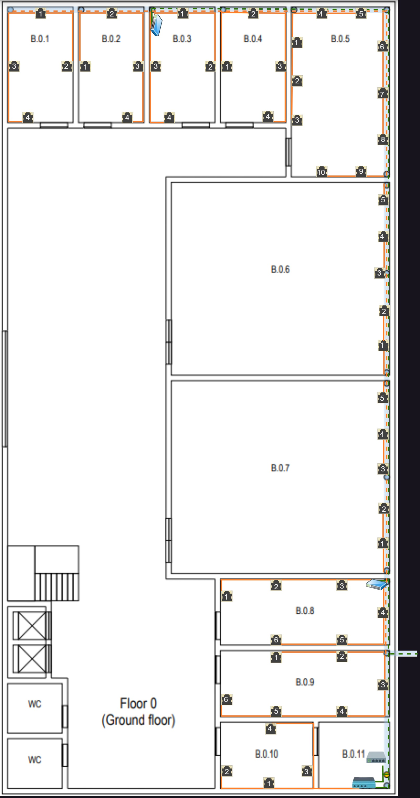
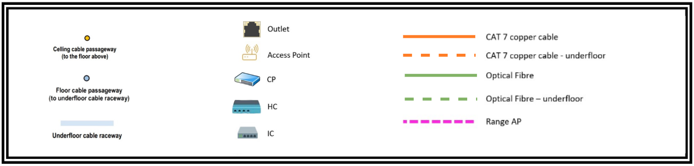
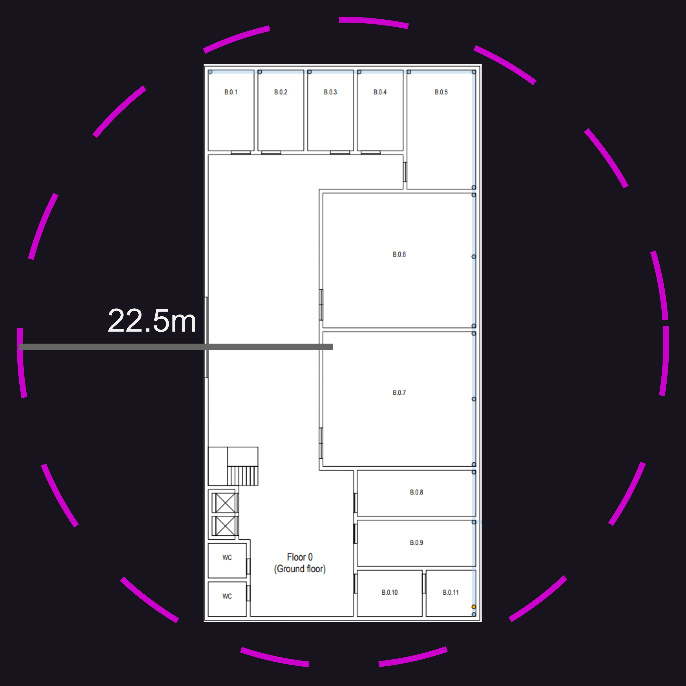
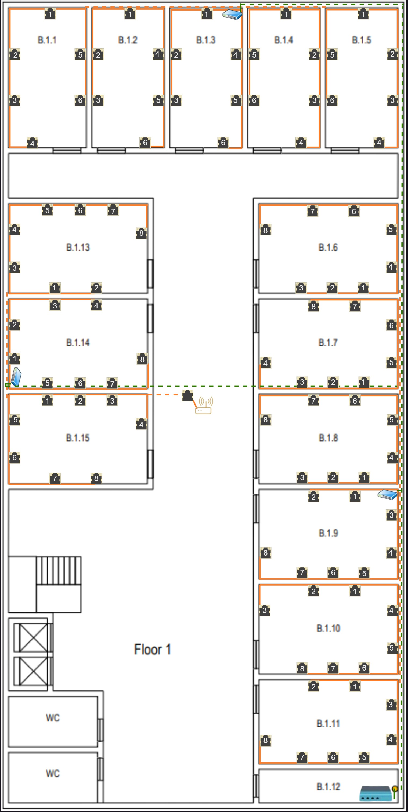
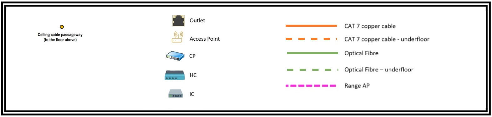
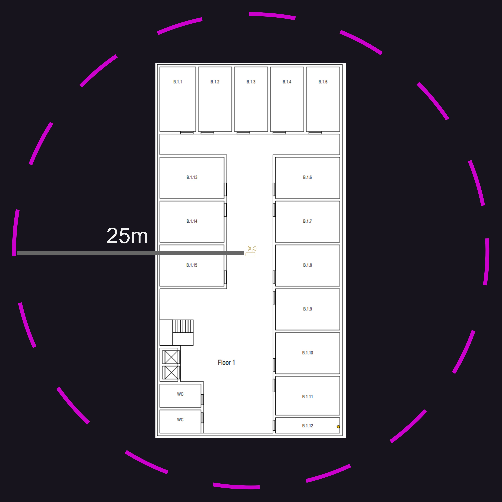

RCOMP 2022-2023 Project - Sprint 1 - Member 1191369 folder
===========================================

# Edificío B

### Medida do edifício:
- Largura: 40m
- Comprimento: 20m
- Área: 40m × 20m = 800m²

## Piso 0

### Medida da escala utilizada para medir as salas:
- 5m (real) = 155px (imagem), com 125% de aproximação no documento utilizando o Google Chrome para a sua visualização.

### Medidas efetuadas e informações Calculadas:

| Sala   | Comprimento (px) | Largura (px) | Comprimento (m) | Largura (m) | A (m²) | Quantidade de Outlets |
|--------|------------------|--------------|-----------------|-------------|--------|---------|
| B.0.1  | 103              | 182          | 3.32            | 5.87        | 19.49  | 4       |
| B.0.2  | 103              | 182          | 3.32            | 5.87        | 19.49  | 4       |
| B.0.3  | 103              | 182          | 3.32            | 5.87        | 19.49  | 4       |
| B.0.4  | 103              | 182          | 3.32            | 5.87        | 19.49  | 4       |
| B.0.5  | 154              | 261          | 4.97            | 8.42        | 41.85  | 10      |
| B.0.6  | 346              | 305          | 11.16           | 9.84        | 109.81 | 5*      |
| B.0.7  | 346              | 305          | 11.16           | 9.84        | 109.81 | 5*      |
| B.0.8  | 267              | 103          | 8.61            | 3.32        | 28.59  | 6       |
| B.0.9  | 267              | 103          | 8.61            | 3.32        | 28.59  | 6       |
| B.0.10 | 146              | 104          | 4.71            | 3.35        | 15.78  | 4       |
| B.0.11 | 111              | 103          | 3.58            | 3.32        | 11.89  | 0*      |
*Sala com características especiais

### Plano Esquemático:

### Legenda:

### Justificações Relevantes:

#### Construção
- O piso 0 tem uma ligação de cabos no subsolo conectada à vala técnica externa.

- Existem acessos ao canal de cabos subterrâneo nas salas, estando estes disponíveis nos pontos marcados no plano esquemático.

- A altura do teto neste andar é de 4 metros.

- A sala B.0.11 conta também com a possibilidade da passagem de cabos para o piso 1, ligando assim a sala B.0.11 à sala B.1.12.

#### Outlets
- As salas B.0.6 e B.0.7 têm um uso especial e as únicas 5 *outlets* necessárias, em cada sala, são ao longo da calha de cabos do piso.

- A sala B.0.11 é utilizada para armazenar uma *cross-connect*. Aqui não são necessárias *outlets*, e o mesmo se aplica a banheiros e áreas comuns, como por exemplo,*hall* de entrada e corredores.

- A distribuição das *outlets* pelas salas foi realizada de forma a que seja possível ligar um dispositivo em qualquer zona da sala (com exeção das salas B.0.6 e B.0.7, devido às suas restrições), permitindo uma grande abrangência das *outlets*.

- Para realizar a ligação de uma *outlet* ao *CP* correspondente, é feita atráves de passagem de cabos por baixo do chão, até um ponto de saída identificado no plano esquemático (caso a *outlet* esteja numa sala diferente do *CP*, pois caso contrário é utilizado um canal próprio que será abordado ainda neste parágrafo). Nas salas em que apenas existe um ponto de saída de cabos por baixo do chão para a sala, a restante ligação das *outlets* por toda a sala é feita através da passagem dos cabos junto da parede de forma a não ocuparem muito espaço, e a evitar possíveis acidentes ao tropeçar num cabo, caso eles tivessem colocados pelo chão. Estes cabos junto da parede encontram-se num canal próprio a 40cm do chão. Nas salas em que existem mais do que uma saída dos cabos do chão para a sala, a ligação das *outlets* é feita através da passagem do cabo pela saída mais próxima da *outlet* em questão, por forma a que seja necessário a menor quantidade de cabo possível.

#### Access Point (AP)
Este piso não conta com a presença de um *AP*, pois o que se encontra no piso 1 consegue servir este andar, como podemos verificar mais à frente neste documento. De qualquer das formas, caso fosse possível colocar mais uma *outlet* na sala B.0.7 e fora do *underfloor cable raceway*, seria uma boa ideia colocar aqui o *AP* em vez de no piso 1, pois iria ter um melhor aproveitamento em ambos os pisos. (Dizemos esta sala, pois é onde se encontra o "centro" do edifício)

##### Alcance do Access Point

- O alcance do Access Point em termos de largura neste piso diminui um pouco devido a que o piso se encontre um pouco mais abaixo do *AP* do piso 1 do que o próprio piso 1. Se imaginarmos uma esfera colocada no centro do piso 1, podemos observar que o piso 0 ficará num local onde o raio entre o centro do piso 0 e a extremidade da esfera é menor.

#### Consolidation Points (CP)
- Neste neste piso do edifício foram colocados 2 *Consolidation* *Points*:
  1. Um encontra-se na sala B.0.3, que é responsável por servir as salas B.0.1, B.0.2, B.0.3, B.0.4 e B.0.5. No total, este CP é responsável por 26 outlets; 
  2. O outro encontra-se na sala B.0.8, que é responsável por servir as salas B.0.6, B.0.7, B.0.8 e B.0.9. No total, este CP é responsável por 22 outlets; 

- A ligação feita do *HC* com os *CP's* é feita por baixo do chão (*underfloor cable raceway*), em que é utilizada fibra ótica para a realização desta ligação, por forma a obtermos maiores velocidades em relação a caso a ligação fosse feita com cabos de cobre CAT7.

#### Horizontal cross-connect (HC)
- Este piso possui apenas um *HC*, pois o edifício conta com 800 metros quadrados de área e a norma exige que haja 1 *HC* por cada 1000 metros quadrados de área bruta.

- O *HC* está situado na sala B.0.11 dentro de um armário técnico, pois o cliente indicou que esta sala será utilizada como área de armazenamento, sendo que esta deve abrigar um *cross-connect*.

- O comprimento de cada cabo que sai deste *HC* é inferior a 90 m, não existindo problemas relacionados com o excesso de comprimento de cabo.

#### Intermediate cross-connect (IC)
- O *IC* recebe a conexão de fibra óptica do *MC* e distribui o sinal para os dois *HC's* deste edifício por meio de cabos de fibra óptica. Estes dois *HC's* são o que se encontra no piso 0, e o que se encontra no piso 1.

- O *Intermediate cross-connect* está localizado na sala B.0.11 num armário técnico separado do *Horizontal cross-connect*, por forma a que caso exista um problema proveniente da rede externa ou interna ao edifício, seja de mais fácil resolução, e sem que haja confusão. Cada coisa deve ficar no seu devido lugar.

#### Cabos Utilizados e Respetivas Quantidades
- Para conectar os *CP's* aos *outlets* é utilizado o cabo de cobre CAT7.

- Devido à inexistência de custos associados ao projeto e orçamentos a cumprir, existe a possibilidade de alcançar uma transmissão de dados mais rápida utilizando um cabo de fibra óptica monomodo de 8 fios para interligar o *HC* com os *CP's*, e o *IC* com os *HC's*, sendo então esses os cabos escolhidos para esse efeito.

- Para a ligação do *IC* ao *MC* também utiliza-se fibra ótica monomodo de 8 fios.

##### Cabos de Cobre CAT7
Para realizar a medição do cabo de cobre CAT7 necessário para ligar cada *outlet* ao respetivo CP, foi tomado em consideração os seguintes aspetos:
- A parte de baixo das caixas que contém os *CP*, os *HC* e o *IC* estão a 1.35m do chão;
- É necessário 1.60m de cabo para descer do *CP*, do *HC* e do *IC* até ao chão, e vise-versa;
- É necessário 1.20m de cabo para descer do *CP* até a 0.40m do chão;
- Na imagem, a representação de uma *outlet* ocupa cerca de 0.58m, sendo que a *outlet* é colocada no centro;
- As portas da sala têm 2.10m;
- A cada 5m de cabo é adicionado uma proporção de 0.5m para que haja a certeza de que todos os *outlets* são ligados com sucesso (é preferivél termos um pouco de cabo a mais, do que termos a menos, pois nesta última situação temos um grande problema);
- Os cabos que passam junto da parede encontram-se a 0.40m do chão.

**Nas tabelas que se seguem, o valor que se encontra entre parêntisis é o valor adicionado para a proporção medida. Desta forma, com a adição de cabo com proporção de 5m para 0.5m, conseguesse uma melhor garantia de que não há falta de cabo para a ligação das *outlets*.**

###### Sala B.0.1
| Outlet    | Quantidade de cabo CAT 7 necessário desde o CP até ao outlet (m) |
|-----------|------------------------------------------------------------------|
| 1         | 12.21 (+1.11)                                                    |
| 2         | 17.42 (+1.58)                                                    |
| 3         | 13.70 (+1.25)                                                    |
| 4         | 18.02 (+1.64)                                                    |
| **Total** | 61.35                                                            |

###### Sala B.0.2
| Outlet    | Quantidade de cabo CAT 7 necessário desde o CP até ao outlet (m) |
|-----------|------------------------------------------------------------------|
| 1         | 9.58 (+0.87)                                                     |
| 2         | 7.36 (+0.74)                                                     |
| 3         | 13.28 (+1.21)                                                    |
| 4         | 17.39 (+1.58)                                                    |
| **Total** | 47.61                                                            |

###### Sala B.0.3
| Outlet    | Quantidade de cabo CAT 7 necessário desde o CP até ao outlet (m) |
|-----------|------------------------------------------------------------------|
| 1         | 3.2 (+0.29)                                                      |
| 2         | 8.37 (+0.76)                                                     |
| 3         | 4.65 (+0.42)                                                     |
| 4         | 8.98 (+0.82)                                                     |
| **Total** | 25.20                                                            |

###### Sala B.0.4
| Outlet    | Quantidade de cabo CAT 7 necessário desde o CP até ao outlet (m) |
|-----------|------------------------------------------------------------------|
| 1         | 9.58 (+0.87)                                                     |
| 2         | 7.36 (+0.74)                                                     |
| 3         | 13.28 (+1.21)                                                    |
| 4         | 17.39 (+1.58)                                                    |
| **Total** | 47.61                                                            |

###### Sala B.0.5
| Outlet    | Quantidade de cabo CAT 7 necessário desde o CP até ao outlet (m) |
|-----------|------------------------------------------------------------------|
| 1         | 12.23 (+1.11)                                                    |
| 2         | 14.40 (+1.31)                                                    |
| 3         | 16.63 (+1.51)                                                    |
| 4         | 11.96 (+1.09)                                                    |
| 5         | 14.19 (+1.29)                                                    |
| 6         | 17.95 (+1.63)                                                    |
| 7         | 20.61 (+1.87)                                                    |
| 8         | 23.24 (+2.11)                                                    |
| 9         | 26.61 (+2.42)                                                    |
| 10        | 28.81 (+2.62)                                                    |
| **Total** | 186.63                                                           |

###### Sala B.0.6
| Outlet    | Quantidade de cabo CAT 7 necessário desde o CP até ao outlet (m) |
|-----------|------------------------------------------------------------------|
| 1         | 15.46 (+1.41)                                                    |
| 2         | 17.16 (+1.56)                                                    |
| 3         | 19.58 (+1.78)                                                    |
| 4         | 21.64 (+1.97)                                                    |
| 5         | 25.58 (+2.33)                                                    |
| **Total** | 99.42                                                            |

###### Sala B.0.7
| Outlet    | Quantidade de cabo CAT 7 necessário desde o CP até ao outlet (m) |
|-----------|------------------------------------------------------------------|
| 1         | 4.21 (+0.38)                                                     |
| 2         | 6.19 (+0.56)                                                     |
| 3         | 8.44 (+0.77)                                                     |
| 4         | 10.42 (+0.94)                                                    |
| 5         | 14.32 (+1.30)                                                    |
| **Total** | 43.58                                                            |

###### Sala B.0.8
| Outlet    | Quantidade de cabo CAT 7 necessário desde o CP até ao outlet (m) |
|-----------|------------------------------------------------------------------|
| 1         | 11.92 (+1.08)                                                    |
| 2         | 7.78 (+0.71)                                                     |
| 3         | 4.05 (+0.37)                                                     |
| 4         | 3.24 (+0.30)                                                     |
| 5         | 7.85 (+0.72)                                                     |
| 6         | 11.57 (+1.05)                                                    |
| **Total** | 46.41                                                            |

###### Sala B.0.9
| Outlet    | Quantidade de cabo CAT 7 necessário desde o CP até ao outlet (m) |
|-----------|------------------------------------------------------------------|
| 1         | 12.73 (+1.16)                                                    |
| 2         | 8.93 (+0.81)                                                     |
| 3         | 8.08 (+0.74)                                                     |
| 4         | 12.69 (+1.15)                                                    |
| 5         | 16.45 (+1.5)                                                     |
| 6         | 20.57 (+1.87)                                                    |
| **Total** | 79.45                                                            |

###### Sala B.0.10
| Outlet    | Quantidade de cabo CAT 7 necessário desde o CP até ao outlet (m) |
|-----------|------------------------------------------------------------------|
| 1         | 5.99 (+0.55)                                                     |
| 2         | 9.79 (+0.89)                                                     |
| 3         | 4.54 (+0.41)                                                     |
| 4         | 13.50 (+1.23)                                                    |
| **Total** | 33.82                                                            |

##### Cabos Fibra Ótica
O *IC* está ligado ao *HC* sem que os cabos sejam colocados a 0.40m do solo.

| Ligação                             | Quantidade de cabo fibra ótica monomodo de 8 fios necessário (m) |
|-------------------------------------|------------------------------------------------------------------|
| CP da sala B.0.3 até ao HC do piso  | 60.51 (+5.50)                                                    |
| CP da sala B.0.8 até ao HC do piso  | 16.53 (+1.50)                                                    |
| IC até ao HC do piso                | 1.88 (+0.17)                                                     |
| IC até a saída do edifício          | 10.32 (+0.94)                                                    |
| **Total**                           | 89.24                                                            |

#### Gabinetes de Telecomunicações

##### Sala B.0.3
- Atualmente existem 26 *outlets* ligados ao *CP* presente nesta sala. Será necessário instalar um *patch panels CAT7* com 48 portas, tendo então o tamanho de 2U.

- Como a conexão entre o *HC* e o *CP* é realizada com cabo de fibra ótica monomodo será necessário 1 *fiber patch panel*, tendo este o tamanho de 1U.

- Como está a ser utilizado 3U de *patch panels*, adicionam-se mais 3U para os *switches* correspondentes esperados, perfazendo 6U. Fazendo um dimensionamento adicional de 100%, resulta em 12U. Posto isto, **o tamanho total para este gabinete de telecomunicações será de 12U.**

##### Sala B.0.8
- Atualmente existem 22 *outlets* ligados ao *CP* presente nesta sala. Será necessário instalar um *patch panels CAT7* com 24 portas, tendo então o tamanho de 1U.

- Como a conexão entre o *HC* e o *CP* é realizada com cabo de fibra ótica monomodo será necessário 1 *fiber patch panel*, tendo este o tamanho de 1U.

- Como está a ser utilizado 2U de *patch panels*, adicionam-se mais 2U para os *switches* correspondentes esperados, perfazendo 4U. Fazendo um dimensionamento adicional de 100%, resulta em 8U. Posto isto, comercialmente falando, **o tamanho total para este gabinete de telecomunicações será de 12U.**

##### Sala B.0.11
- Considerando que o *HC* está ligado ao *IC* e a dois *CP's* através de cabo de fibra ótica monomodo, é necessário utilizar um *Fiber Patch Panel* para realizar essas conexões, tendo este o tamanho de 1U.

- Como está a ser usado um único *patch panel* de 1U, adicionamos outra 1U para o *switch* correspondente esperado, totalizando 2U, e um dimensionamento adicional de 100%, perfazendo 4U. O tamanho disponível comercialmente começa em 6U. Posto isto, **o tamanho total para este gabinete de telecomunicações será de 6U.**

### Inventário total do Piso 0:
| Equipamento                         | Quantidade | 
|-------------------------------------|------------|
| Access Points                       | 0          |
| Quantidade de Copper Cable CAT7 (m) | 671.08     |
| Copper Patch Cords de 0.5m          | 72         |
| Copper Patch Cords de 5m            | 52         |
| Copper Patch Panel 1U (24 entradas) | 1          |
| Copper Patch Panel 2U (48 entradas) | 1          |
| Fiber Optic Cable (m)               | 89.24      |
| Fiber Patch Cords (0.5m)            | 72         |
| Fiber Patch Panel 1U (24 entradas)  | 3          |
| Outlets                             | 52         |
| Telecommunication Enclosure 12U     | 2          |
| Telecommunication Enclosure 6U      | 1          |

## Piso 1

### Medida da escala utilizada para medir as salas:
- 5m (real) = 155px (imagem), com 125% de aproximação no documento utilizando o Google Chrome para a sua visualização.

### Medidas efetuadas e informações Calculadas:

| Sala   | Comprimento (px) | Largura (px) | Comprimento (m) | Largura (m) | A (m²) | Outlets |
|--------|------------------|--------------|-----------------|-------------|--------|---------|
| B.1.1  | 123              | 222          | 3.97            | 7.16        | 28.43  | 6       |
| B.1.2  | 114              | 222          | 3.68            | 7.16        | 26.35  | 6       |
| B.1.3  | 114              | 222          | 3.68            | 7.16        | 26.35  | 6       |
| B.1.4  | 114              | 222          | 3.68            | 7.16        | 26.35  | 6       |
| B.1.5  | 114              | 222          | 3.68            | 7.16        | 26.35  | 6       |
| B.1.6  | 221              | 142          | 7.13            | 4.58        | 32.66  | 8       |
| B.1.7  | 221              | 142          | 7.13            | 4.58        | 32.66  | 8       |
| B.1.8  | 221              | 142          | 7.13            | 4.58        | 32.66  | 8       |
| B.1.9  | 221              | 142          | 7.13            | 4.58        | 32.66  | 8       |
| B.1.10 | 221              | 142          | 7.13            | 4.58        | 32.66  | 8       |
| B.1.11 | 221              | 132          | 7.13            | 4.26        | 30.37  | 8       |
| B.1.12 | 221              | 52           | 7.13            | 1.68        | 11.98  | 0*      |
| B.1.13 | 221              | 142          | 7.13            | 4.58        | 32.66  | 8       |
| B.1.14 | 221              | 142          | 7.13            | 4.58        | 32.66  | 8       |
| B.1.15 | 221              | 142          | 7.13            | 4.58        | 32.66  | 8       |
*Sala com características especiais

### Plano Esquemático:

### Legenda:

### Justificações Relevantes:

#### Construção
- O piso 1 **não** tem uma ligação de cabos no subsolo.

- O teto deste piso é de 3 metros, no entanto existe um teto rebaixado amovível, colocado a 2.5 metros do solo, cobrindo todo o piso. Dado isto, podemos afirmar que o espaço sobre o teto rebaixado é perfeito para a instalação de canais de cabos.

- A sala B.1.12 conta também com a possibilidade da passagem de cabos para o piso 0, ligando assim a sala B.1.12 à sala B.0.11.

#### Outlets
- A sala B.1.12 é utilizada para armazenar uma *cross-connect*. Aqui não são necessárias *outlets*, e o mesmo se aplica a banheiros e áreas comuns, como por exemplo,*hall* de entrada e corredores.

- Nas restantes salas, o número padrão de *outlets* por proporção de área é aplicado.

- A distribuição das *outlets* pelas salas foi realizada de forma a que seja possível ligar um dispositivo em qualquer zona da sala, permitindo uma grande abrangência das *outlets*.

- Quando é necessário ligar uma *outlet* de uma sala onde não existe um *CP*, os cabos são passados pelo teto falso, existindo furos nas paredes acima desse teto falso, de forma a que seja possível passar um canal para os cabos. O canal para os cabos é descidos até 40cm do chão assim que possível (na quina da sala mais próxima do *CP*), por forma a servir todos os pontos em que existe uma *outlet*. Se a *outlet* pertence à mesma sala do *CP*, é feito uma ligação dos cabos por um canal também descido do *CP* que depois passa a 40cm do chão.

#### Access Point (AP)
- Devido às dimensões do edifício, foi instalado apenas um *Access Point* no edifício, sendo que este consegue servir o piso 1 e o piso 0.

- Conectado a uma *outlet* por meio de um cabo de cobre *CAT7*, o *Access Point* oferece uma cobertura de cerca de 50 metros de diâmetro em forma de esfera.

##### Alcance do Access Point

- Para a determinação do alcance do *Access Point* utilizou-se aproximadamente um diâmetro de 50m (25m de raio).

#### Consolidation Points (CP)
- Neste neste piso do edifício foram colocados 3 *Consolidation* *Points*:
  1. Um encontra-se na sala B.1.3, que é responsável por servir as salas B.1.1, B.1.2, B.1.3, B.1.4 e B.1.5. No total, este *CP* é responsável por 30 outlets; 
  2. Outro encontra-se na sala B.1.9, que é responsável por servir as salas B.1.6, B.1.7, B.1.8, B.1.9, B.1.10 e B.1.11. No total, este *CP* é responsável por 48 outlets;
  3. Ainda existe outro *CP* que se encontra na sala B.1.14. Este é responsável por servir as salas B.1.13, B.1.14, B.1.15 e ainda o *Access Point* do piso. No total, este *CP* é responsável por 25 outlets.

- A ligação feita do *HC* com os *CP's* é feita por cima do teto falso, onde existem canais para os cabos. Para a realização desta ligação são utilizados cabos de fibra ótica, de forma a obtermos maiores velocidades em relação a caso a ligação fosse feita com cabos de cobre *CAT7*.

#### Horizontal cross-connect (HC)
- Este piso possui apenas um *HC*, pois o edifício conta com 800 metros quadrados de área e a norma exige que haja 1 *HC* por cada 1000 metros quadrados de área bruta.

- O *HC* está situado na sala B.1.12 dentro de um armário técnico, pois o cliente indicou que esta sala será utilizada como área de armazenamento, sendo que esta deve abrigar um *cross-connect*.

- O comprimento de cada cabo que sai deste *HC* é inferior a 90 m, não existindo problemas relacionados com o excesso de comprimento de cabo.

#### Cabos Utilizados e Respetivas Quantidades
- Para conectar os *CP's* aos *outlets* é utilizado o cabo de cobre CAT7.

- Devido à inexistência de custos associados ao projeto e orçamentos a cumprir, existe a possibilidade de alcançar uma transmissão de dados mais rápida utilizando um cabo de fibra óptica monomodo de 8 fios para interligar o *HC* com os *CP's*, e o *IC* com os *HC's*, sendo então esses os cabos escolhidos para esse efeito.

- Para a ligação do *IC* ao *MC* também utiliza-se fibra ótica monomodo de 8 fios.

##### Cabos de Cobre CAT7
Para realizar a medição do cabo de cobre CAT7 necessário para ligar cada *outlet* ao respetivo CP, foi tomado em consideração os seguintes aspetos:
- A parte de baixo das caixas que contém os *CP* e o *HC* estão a 1.35m do chão;
- É necessário 2.20m de cabo para descer do teto falso até à altura de 0.40m do chão (o mesmo se aplica de subir da altura de 0.40m do chão até ao teto falso);
- É necessário 1.20m de cabo para descer do *CP* até a 0.40m do chão;
- É necessário 1m de cabo para subir do *CP* até ao teto falso;
- Na imagem, a representação de uma *outlet* ocupa cerca de 0.58m, sendo que a *outlet* é colocada no centro;
- A cada 5m de cabo é adicionado uma proporção de 0.5m para que haja a certeza de que todos os *outlets* são ligados com sucesso (é preferivél termos um pouco de cabo a mais, do que termos a menos, pois nesta última situação temos um grande problema);
- Os cabos que são passos junto da parede encontram-se a 0.40m do chão;
- Os cabos são descidos do teto falso na quina da sala mais próxima do *CP*.

**Nas tabelas que se seguem, o valor que se encontra entre parêntisis é o valor adicionado para a proporção medida. Desta forma, com a adição de cabo com proporção de 5m para 0.5m, conseguesse uma melhor garantia de que não há falta de cabo para a ligação das *outlets*.**

###### Sala B.1.1
| Outlet    | Quantidade de cabo CAT 7 necessário desde o CP até ao outlet (m) |
|-----------|------------------------------------------------------------------|
| 1         | 14.45 (+1.31)                                                    |
| 2         | 19.38 (+1.76)                                                    |
| 3         | 21.97 (+2.00)                                                    |
| 4         | 25.98 (+2.36)                                                    |
| 5         | 15.09 (+1.37)                                                    |
| 6         | 17.68 (+1.61)                                                    |
| **Total** | 114.55                                                           |

###### Sala B.1.2
| Outlet    | Quantidade de cabo CAT 7 necessário desde o CP até ao outlet (m) |
|-----------|------------------------------------------------------------------|
| 1         | 9.9 (+0.90)                                                      |
| 2         | 14.65 (+1.33)                                                    |
| 3         | 17.24 (+1.57)                                                    |
| 4         | 10.57 (+0.96)                                                    |
| 5         | 13.16 (+1.20)                                                    |
| 6         | 16.86 (+1.53)                                                    |
| **Total** | 82.38                                                            |

###### Sala B.1.3
| Outlet    | Quantidade de cabo CAT 7 necessário desde o CP até ao outlet (m) |
|-----------|------------------------------------------------------------------|
| 1         | 3.27 (+0.30)                                                     |
| 2         | 7.94 (+0.72)                                                     |
| 3         | 10.53 (+0.96)                                                    |
| 4         | 3.91 (+0.36)                                                     |
| 5         | 6.49 (+0.59)                                                     |
| 6         | 10.22 (+0.93)                                                    |
| **Total** | 42.36                                                            |

###### Sala B.1.4
| Outlet    | Quantidade de cabo CAT 7 necessário desde o CP até ao outlet (m) |
|-----------|------------------------------------------------------------------|
| 1         | 6.05 (+0.55)                                                     |
| 2         | 10.48 (+0.95)                                                    |
| 3         | 13.07 (+1.19)                                                    |
| 4         | 16.80 (+1.53)                                                    |
| 5         | 6.47 (+0.59)                                                     |
| 6         | 9.05 (+0.82)                                                     |
| **Total** | 61.92                                                            |

###### Sala B.1.5
| Outlet    | Quantidade de cabo CAT 7 necessário desde o CP até ao outlet (m) |
|-----------|------------------------------------------------------------------|
| 1         | 10.47 (+0.95)                                                    |
| 2         | 15 (+1.36)                                                       |
| 3         | 17.59 (+1.60)                                                    |
| 4         | 21.25 (+1.93)                                                    |
| 5         | 11.01 (+1.00)                                                    |
| 6         | 13.60 (+1.24)                                                    |
| **Total** | 88.92                                                            |

###### Sala B.1.6
| Outlet    | Quantidade de cabo CAT 7 necessário desde o CP até ao outlet (m) |
|-----------|------------------------------------------------------------------|
| 1         | 16.72 (+1.52)                                                    |
| 2         | 18.46 (+1.68)                                                    |
| 3         | 20.20 (+1.84)                                                    |
| 4         | 16.21 (+1.47)                                                    |
| 5         | 18.30 (+1.66)                                                    |
| 6         | 22.14 (+2.01)                                                    |
| 7         | 24.45 (+2.22)                                                    |
| 8         | 29.00 (+2.64)                                                    |
| **Total** | 165.48                                                            |

###### Sala B.1.7
| Outlet    | Quantidade de cabo CAT 7 necessário desde o CP até ao outlet (m) |
|-----------|------------------------------------------------------------------|
| 1         | 11.25 (+1.02)                                                    |
| 2         | 12.96 (+1.18)                                                    |
| 3         | 14.66 (+1.33)                                                    |
| 4         | 18.63 (+1.69)                                                    |
| 5         | 10.79 (+0.98)                                                    |
| 6         | 12.91 (+1.17)                                                    |
| 7         | 16.78 (+1.53)                                                    |
| 8         | 19.09 (+1.74)                                                    |
| **Total** | 117.07                                                           |

###### Sala B.1.8
| Outlet    | Quantidade de cabo CAT 7 necessário desde o CP até ao outlet (m) |
|-----------|------------------------------------------------------------------|
| 1         | 5.86 (+0.53)                                                     |
| 2         | 7.57 (+0.69)                                                     |
| 3         | 9.27 (+0.84)                                                     |
| 4         | 5.40 (+0.49)                                                     |
| 5         | 7.49 (+0.68)                                                     |
| 6         | 11.39 (+1.04)                                                    |
| 7         | 13.70 (+1.25)                                                    |
| 8         | 18.30 (+1.66)                                                    |
| **Total** | 78.98                                                            |

###### Sala B.1.9
| Outlet    | Quantidade de cabo CAT 7 necessário desde o CP até ao outlet (m) |
|-----------|------------------------------------------------------------------|
| 1         | 3.73 (+0.34)                                                     |
| 2         | 6.04 (+0.55)                                                     |
| 3         | 2.81 (+0.26)                                                     |
| 4         | 4.90 (+0.45)                                                     |
| 5         | 8.26 (+0.75)                                                     |
| 6         | 9.97 (+0.91)                                                     |
| 7         | 11.67 (+1.06)                                                    |
| 8         | 15.64 (+1.42)                                                    |
| **Total** | 63.02                                                            |

###### Sala B.1.10
| Outlet    | Quantidade de cabo CAT 7 necessário desde o CP até ao outlet (m) |
|-----------|------------------------------------------------------------------|
| 1         | 11.44 (+1.04)                                                    |
| 2         | 13.75 (+1.25)                                                    |
| 3         | 18.36 (+1.67)                                                    |
| 4         | 10.47 (+0.95)                                                    |
| 5         | 12.56 (+1.14)                                                    |
| 6         | 15.93 (+1.45)                                                    |
| 7         | 17.63 (+1.60)                                                    |
| 8         | 19.34 (+1.76)                                                    |
| **Total** | 119.48                                                           |

###### Sala B.1.11
| Outlet    | Quantidade de cabo CAT 7 necessário desde o CP até ao outlet (m) |
|-----------|------------------------------------------------------------------|
| 1         | 16.83 (+1.53)                                                    |
| 2         | 19.14 (+1.74)                                                    |
| 3         | 15.83 (+1.44)                                                    |
| 4         | 17.74 (+1.61)                                                    |
| 5         | 21.01 (+1.91)                                                    |
| 6         | 22.72 (+2.07)                                                    |
| 7         | 24.42 (+2.22)                                                    |
| 8         | 28.12 (+2.56)                                                    |
| **Total** | 165.81                                                           |

###### Sala B.1.13
| Outlet    | Quantidade de cabo CAT 7 necessário desde o CP até ao outlet (m) |
|-----------|------------------------------------------------------------------|
| 1         | 11.62 (+1.06)                                                    |
| 2         | 13.93 (+1.27)                                                    |
| 3         | 10.47 (+0.95)                                                    |
| 4         | 12.56 (+1.14)                                                    |
| 5         | 16.21 (+1.47)                                                    |
| 6         | 18.02 (+1.64)                                                    |
| 7         | 19.82 (+1.80)                                                    |
| 8         | 23.44 (+2.13)                                                    |
| **Total** | 126.07                                                           |

###### Sala B.1.14
| Outlet    | Quantidade de cabo CAT 7 necessário desde o CP até ao outlet (m) |
|-----------|------------------------------------------------------------------|
| 1         | 3.03 (+0.28)                                                     |
| 2         | 4.94 (+0.45)                                                     |
| 3         | 9.02 (+0.82)                                                     |
| 4         | 11.33 (+1.03)                                                    |
| 5         | 3.52 (+0.32)                                                     |
| 6         | 5.37 (+0.49)                                                     |
| 7         | 7.14 (+0.65)                                                     |
| 8         | 10.84 (+0.99)                                                    |
| **Total** | 55.19                                                            |

###### Sala B.1.15
| Outlet    | Quantidade de cabo CAT 7 necessário desde o CP até ao outlet (m) |
|-----------|------------------------------------------------------------------|
| 1         | 6.15 (+0.56)                                                     |
| 2         | 7.95 (+0.72)                                                     |
| 3         | 9.76 (+0.89)                                                     |
| 4         | 13.45 (+1.22)                                                    |
| 5         | 5.30 (+0.48)                                                     |
| 6         | 7.39 (+0.67)                                                     |
| 7         | 11.58 (+1.05)                                                    |
| 8         | 13.89 (+1.26)                                                    |
| **Total** | 75.47                                                            |

###### Access Point
| Quantidade de cabo CAT 7 necessário desde o outlet do AP até ao CP |
|--------------------------------------------------------------------|
| 14.01 (+1.27)                                                      |

##### Cabos Fibra Ótica
| Ligação                            | Quantidade de cabo fibra ótica monomodo de 8 fios necessário (m) |
|------------------------------------|------------------------------------------------------------------|
| CP da sala B.1.3 até o HC do piso  | 55.14 (+5.01)                                                    |
| CP da sala B.1.9 até o HC do piso  | 19.31 (+1.76)                                                    |
| CP da sala B.1.14 até o HC do piso | 47.37 (+4.31)                                                    |
| IC do piso 0 até o HC do piso 1    | 5.33 (+0.49)                                                     |
| **Total**                          | 127.15                                                           |

#### Gabinetes de Telecomunicações

##### Sala B.1.3
- Atualmente existem 30 *outlets* ligados ao *CP* presente nesta sala. Será necessário instalar um *patch panels CAT7* com 48 portas, tendo então o tamanho de 2U.

- Como a conexão entre o *HC* e o *CP* é realizada com cabo de fibra ótica monomodo será necessário 1 *fiber patch panel*, tendo este o tamanho de 1U.

- Como está a ser utilizado 3U de *patch panels*, adicionam-se mais 3U para os *switches* correspondentes esperados, perfazendo 6U. Fazendo um dimensionamento adicional de 100%, resulta em 12U. Posto isto, **o tamanho total para este gabinete de telecomunicações será de 12U.**

##### Sala B.1.9
- Atualmente existem 48 *outlets* ligados ao *CP* presente nesta sala. Será necessário instalar um *patch panels CAT7* com 48 portas, tendo então o tamanho de 2U.

- Como a conexão entre o *HC* e o *CP* é realizada com cabo de fibra ótica monomodo será necessário 1 *fiber patch panel*, tendo este o tamanho de 1U.

- Como está a ser utilizado 3U de *patch panels*, adicionam-se mais 3U para os *switches* correspondentes esperados, perfazendo 6U. Fazendo um dimensionamento adicional de 100%, resulta em 12U. Posto isto, **o tamanho total para este gabinete de telecomunicações será de 12U.**

##### Sala B.1.14
- Atualmente existem 25 *outlets* ligados ao *CP* presente nesta sala. Será necessário instalar um *patch panels CAT7* com 48 portas (comercialmente falando), tendo então o tamanho de 2U.

- Como a conexão entre o *HC* e o *CP* é realizada com cabo de fibra ótica monomodo será necessário 1 *fiber patch panel*, tendo este o tamanho de 1U.

- Como está a ser utilizado 3U de *patch panels*, adicionam-se mais 3U para os *switches* correspondentes esperados, perfazendo 6U. Fazendo um dimensionamento adicional de 100%, resulta em 12U. Posto isto, **o tamanho total para este gabinete de telecomunicações será de 12U.**

##### Sala B.1.12
- Considerando que o *HC* está ligado ao *IC* que encontra-se no piso 0 e a três *CP's* através de cabo de fibra ótica monomodo, 
  é necessário utilizar um *Fiber Patch Panel* para realizar essas conexões, tendo este o tamanho de 1U.

- Como está a ser utilizado um único *patch panel* de 1U, adicionamos outra 1U para o *switch* correspondente esperado, totalizando 2U, e um dimensionamento adicional de 100%, perfazendo 4U. O tamanho disponível comercialmente começa em 6U. Posto isto, **o tamanho total para este gabinete de telecomunicações será de 6U.**

### Inventário total do Piso 1:
| Equipamento                         | Quantidade | 
|-------------------------------------|------------|
| Access Points                       | 1          |
| Quantidade de Copper Cable CAT7 (m) | 1370.71    |
| Copper Patch Cords de 0.5m          | 145        |
| Copper Patch Cords de 5m            | 102        |
| Copper Patch Panel 1U (24 entradas) | 0          |
| Copper Patch Panel 2U (48 entradas) | 3          |
| Fiber Optic Cable (m)               | 127.15     |
| Fiber Patch Cords (0.5m)            | 96         |
| Fiber Patch Panel 1U (24 entradas)  | 4          |
| Outlets                             | 103        |
| Telecommunication Enclosure 12U     | 3          |
| Telecommunication Enclosure 6U      | 1          |

## Inventário total do Edifício:
| Equipamento                         | Quantidade | 
|-------------------------------------|------------|
| Access Points                       | 1          |
| Quantidade de Copper Cable CAT7 (m) | 2041.79    |
| Copper Patch Cords de 0.5m          | 217        |
| Copper Patch Cords de 5m            | 154        |
| Copper Patch Panel 1U (24 entradas) | 1          |
| Copper Patch Panel 2U (48 entradas) | 4          |
| Fiber Optic Cable (m)               | 216.39     |
| Fiber Patch Cords (0.5m)            | 168        |
| Fiber Patch Panel 1U (24 entradas)  | 7          |
| Outlets                             | 155        |
| Telecommunication Enclosure 12U     | 5          |
| Telecommunication Enclosure 6U      | 2          |

## Informações gerais relevantes e importantes
- Foi tido em conta o cuidado de não serem colocadas *outlets* em locais em que quando a porta da sala estivesse aberta, impossibilitaria a utilização dessas mesmas *outlets*.

- A quantidade de *outlets* por sala foi determinada com base numa proporção de 2 *outlets* por cada 10 metros quadrados de área. Vale ressalvar que ao passar as marcas de 10 metros quadrados, é feito o arredondamento para o valor dos próximos 10 metros quadrados. Para explicar melhor esta situação, consideremos o seguinte exemplo: uma sala que contenha 25m², irá contar com 6 *outlets*, pois temos que 10m² será 2 *outlets*, 20m² será 4 *outlets*, mas como 25m² está entre os 20m² e os 30m², fazemos o arredondamento para os 30m², ficando então com 6 *outlets*. Isto devesse a que é sempre uma melhor opção ter *outlets* a mais, do que ter a menos.

## Aplicações gerais importantes
- Os *CP's* devem conter junto de cada entrada uma identificação do cabo que está inserido, ou seja, deve ser possível saber a qual sala e *outlet* pertence aquele cabo lá inserido. Desta forma deve existir uma identificação com o seguinte formato: sala_número_da_outlet, exemplo: B.0.1_1, sabemos que o cabo ligado àquela entrada está a fazer ligação com a *outlet* número 1 da sala B.0.1.

- Em cada entrada dos *HC*, deve também estar devidamente identificado o que está lá conectado, se for um cabo direto a uma *outlet*, deve seguir o mesmo padrã explicado no ponto anterior, caso seja a ligação a um *CP*, deve existir a identificação da sala à qual aquele cabo está a fazer a ligação, por exemplo, B.0.3.