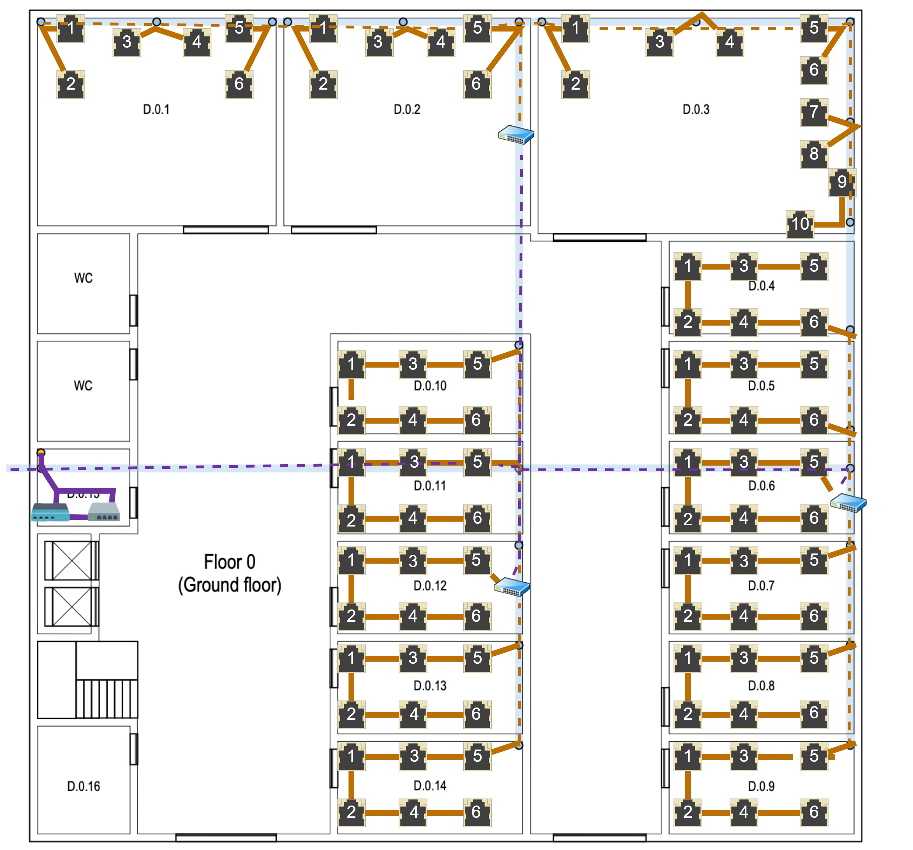
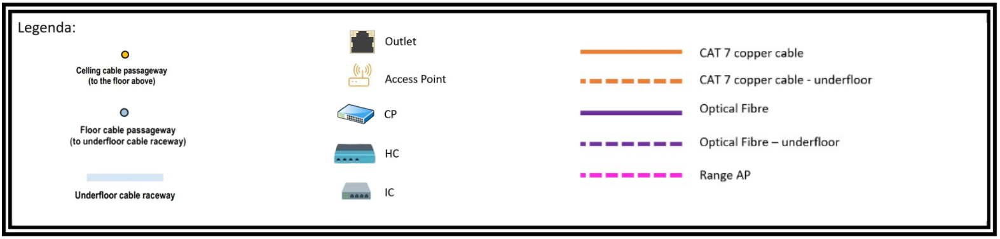
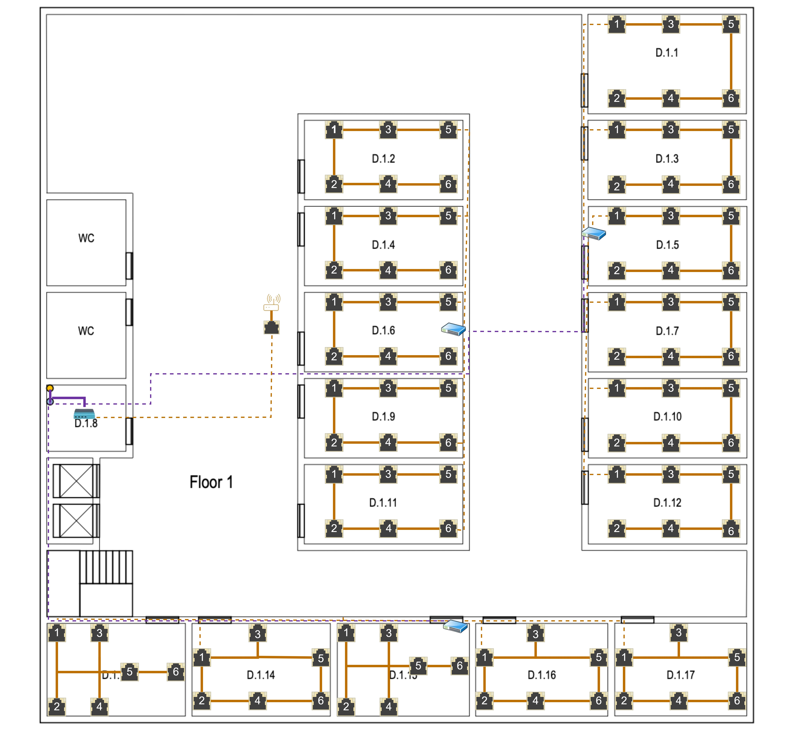

RCOMP 2022-2023 Project - Sprint 1 - Member 1210805 folder
===========================================

## Edificío D

### Medida do edifício:

- 30m × 30m = 900m²

### Piso 0

### Medida da escala:

- 5m (real) = 215px (escala)

#### Informações Calculadas:
| Sala           | Comprimento (px) | Largura (px) | Comprimento (m) | Largura (m) | A (m²) | Outlets |
|----------------|------------------|--------------|-----------------|-------------|--------|---------|
| D.0.1          | 368              | 320          | 8.56            | 7,44        | 63,69  | 6*      |
| D.0.2          | 368              | 320          | 8.56            | 7,44        | 63,69  | 6*      |
| D.0.3          | 490              | 333          | 11,40           | 15,51       | 176,81 | 10*     |
| D.0.4 - D.0.14 | 288              | 145          | 6,70            | 3,37        | 22,58  | 6       |
* Sala com características especiais

### Plano esquemático

### Legenda:

### Justificações Relevantes:

### Outlets
- A sala D.0.15 é uma área de armazenamento que pode ser usada para abrigar uma conexão cruzada, não são necessárias tomadas de rede lá, e o mesmo se aplica à sala D.0.16, casas de banho e áreas comuns como o hall de entrada e corredores.

- A distribuição dos *outlets* foi feita tendo em conta os locais mais adequados para que o espaço da sala não fosse muito
  comprometido, evitando também a sua colocação perto de portas e de forma a permitir um uso mais fácil da área central da
  sala para trabalhar.

- Ao posicionar os *outlets*, também se considerou que a distância máxima entre eles seria de três metros, para que em qualquer
  parte da sala onde o equipamento do utilizador estivesse, pudesse ser facilmente ligado a um *outlet* com o cabo fornecido.

- A quantidade de *outlets* por sala foi determinada com base numa proporção de 2 *outlets* por cada 10 metros quadrados de área.

### Cabos de cobre
- Todos os cabos de cobre devem ser considerados montados na parede, apesar da representação esquemática.

#### Access Point (AP)

- Devido às dimensões do edifício, foi instalado apenas um *access* *point* no edifício, neste caso este encontra-se no piso 1.

##### Alcance do Access Point
- Para a determinação do alcance do access point que encontra-se no piso 1 utilizou-se aproximadamente um diâmetro de 50 m.

#### Consolidation Points (CP)
- Ao todo neste piso foram colocados 3 *Consolidation* *Points*:
  1. Na sala D.0.2,que é responsável por controlar as salas D.0.1 e D.0.3, ficando reponsáveç por 22 outlets;
  2. Na sala D.0.6, que é responsável por controlar as salas D.0.4, D.0.5, D.0.7, D.0.8 e D.0.9, ficando responsável por 36 outlets;
  3. Na sala D.0.12 que é responsável por controlar as salas D.0.10, D.0.11, D.0.13 e D.0.14, ficando reponsável por 30 outlets.

- O *underfloor* *cable* *raceway* realiza a ligação do *HC* com os *CP's*.

#### Horizontal cross-connect (HC)
- Devido à sua ampla cobertura de cerca de 1000 metros quadrados, este piso possui somente um *HC*, mesmo que a área total
  do edifício seja de apenas 900 metros quadrados.

- O *Horizontal* *cross-connect* está localizado na sala D.0.15 no mesmo armário técnico que o Intermediate cross-connect.

- O comprimento de cada cabo é inferior a 90 m.

#### Intermediate cross-connect (IC)
- O *IC* recebe conexão de fibra ótica do *MC* e distribui o sinal para os dois *HC's* deste edifício por meio de cabos de fibra ótica.

- O *Intermediate* *cross-connect* está localizado na sala D.0.15 no mesmo armário técnico que o *Horizontal* *cross-connect*.

#### Cabos Utilizados e Respetivas Quantidades
- Para conectar os *CP's* aos outlets é utilizado o cabo de cobre CAT7.

- Por causa da inexistência de custos associados ao projeto e da possibilidade de alcançar uma transmissão de dados mais rápida, decidiu-se utilizar um cabo de fibra ótica monomodo de 8 fios para interligar o *HC* e os *CP's*, levando em conta também a redundância do sistema.

- Para a ligação di *IC* ao *HC* também foi utilizado fibra ótica monomodo de 8 fios.

##### Cabo de Cobre CAT7
###### Sala D.0.1
| Outlet    | Quantidade de cabo CAT 7 necessário desde o CP até ao outlet (m) |
|-----------|------------------------------------------------------------------|
| 1         | 20.90                                                            |
| 2         | 23.10                                                            |
| 3         | 18.60                                                            |
| 4         | 15.90                                                            |
| 5         | 13.40                                                            |
| 6         | 16.20                                                            |
| **Total** | 108.10                                                           | 

###### Sala D.0.2
| Outlet    | Quantidade de cabo CAT 7 necessário desde o CP até ao outlet (m) |
|-----------|------------------------------------------------------------------|
| 1         | 10.66                                                            |
| 2         | 12.56                                                            |
| 3         | 9.33                                                             |
| 4         | 7.88                                                             |
| 5         | 6.98                                                             |
| 6         | 8.66                                                             |
| **Total** | 56.07                                                            | 

###### Sala D.0.3
| Outlet    | Quantidade de cabo CAT 7 necessário desde o CP até ao outlet (m) |
|-----------|------------------------------------------------------------------|
| 1         | 7.89                                                             |
| 2         | 9.44                                                             |
| 3         | 12.00                                                            |
| 4         | 13.55                                                            |
| 5         | 17.11                                                            |
| 6         | 18.09                                                            |
| 7         | 22.75                                                            |
| 8         | 22.75                                                            |
| 9         | 23.33                                                            |
| 10        | 25.02                                                            |
| **Total** | 149.18                                                           | 

###### Sala D.0.4
| Outlet    | Quantidade de cabo CAT 7 necessário desde o CP até ao outlet (m) |
|-----------|------------------------------------------------------------------|
| 1         | 18.87                                                            |
| 2         | 12.29                                                            |
| 3         | 15.26                                                            |
| 4         | 9.68                                                             |
| 5         | 21.19                                                            |
| 6         | 7.66                                                             |
| **Total** | 84.95                                                            | 

###### Sala D.0.5
| Outlet    | Quantidade de cabo CAT 7 necessário desde o CP até ao outlet (m) |
|-----------|------------------------------------------------------------------|
| 1         | 11.87                                                            |
| 2         | 8.49                                                             |
| 3         | 14.36                                                            |
| 4         | 5.68                                                             |
| 5         | 17.21                                                            |
| 6         | 3.66                                                             |
| **Total** | 62.08                                                            | 

###### Sala D.0.6
| Outlet    | Quantidade de cabo CAT 7 necessário desde o CP até ao outlet (m) |
|-----------|------------------------------------------------------------------|
| 1         | 4.80                                                             |
| 2         | 7.89                                                             |
| 3         | 9.01                                                             |
| 4         | 11.66                                                            |
| 5         | 13.00                                                            |
| 6         | 15.00                                                            |
| **Total** | 61.36                                                            | 

###### Sala D.0.7
| Outlet    | Quantidade de cabo CAT 7 necessário desde o CP até ao outlet (m) |
|-----------|------------------------------------------------------------------|
| 1         | 5.66                                                             |
| 2         | 7.89                                                             |
| 3         | 10.00                                                            |
| 4         | 11.21                                                            |
| 5         | 13.89                                                            |
| 6         | 16.74                                                            |
| **Total** | 65.39                                                            | 

###### Sala D.0.8
| Outlet    | Quantidade de cabo CAT 7 necessário desde o CP até ao outlet (m) |
|-----------|------------------------------------------------------------------|
| 1         | 5.34                                                             |
| 2         | 8.67                                                             |
| 3         | 11.22                                                            |
| 4         | 13.88                                                            |
| 5         | 16.78                                                            |
| 6         | 20.35                                                            |
| **Total** | 76.24                                                            | 

###### Sala D.0.9
| Outlet    | Quantidade de cabo CAT 7 necessário desde o CP até ao outlet (m) |
|-----------|------------------------------------------------------------------|
| 1         | 9.89                                                             |
| 2         | 13.66                                                            |
| 3         | 15.02                                                            |
| 4         | 18.98                                                            |
| 5         | 20.67                                                            |
| 6         | 24.30                                                            |
| **Total** | 102.52                                                           | 

###### Sala D.0.10
| Outlet    | Quantidade de cabo CAT 7 necessário desde o CP até ao outlet (m) |
|-----------|------------------------------------------------------------------|
| 1         | 6.87                                                             |
| 2         | 10.29                                                            |
| 3         | 13.09                                                            |
| 4         | 16.44                                                            |
| 5         | 20.78                                                            |
| 6         | 23.95                                                            |
| **Total** | 91.42                                                            | 

###### Sala D.0.11
| Outlet    | Quantidade de cabo CAT 7 necessário desde o CP até ao outlet (m) |
|-----------|------------------------------------------------------------------|
| 1         | 4.27                                                             |
| 2         | 7.49                                                             |
| 3         | 10.26                                                            |
| 4         | 13.38                                                            |
| 5         | 16.65                                                            |
| 6         | 19.77                                                            |
| **Total** | 71.82                                                            | 

###### Sala D.0.12
| Outlet    | Quantidade de cabo CAT 7 necessário desde o CP até ao outlet (m) |
|-----------|------------------------------------------------------------------|
| 1         | 1.37                                                             |
| 2         | 3.29                                                             |
| 3         | 5.26                                                             |
| 4         | 9.68                                                             |
| 5         | 12.65                                                            |
| 6         | 15.58                                                            |
| **Total** | 48.10                                                            | 

###### Sala D.0.13
| Outlet    | Quantidade de cabo CAT 7 necessário desde o CP até ao outlet (m) |
|-----------|------------------------------------------------------------------|
| 1         | 3.97                                                             |
| 2         | 5.59                                                             |
| 3         | 8.46                                                             |
| 4         | 12.68                                                            |
| 5         | 15.65                                                            |
| 6         | 18.26                                                            |
| **Total** | 64.61                                                            | 

###### Sala D.0.14
| Outlet    | Quantidade de cabo CAT 7 necessário desde o CP até ao outlet (m) |
|-----------|------------------------------------------------------------------|
| 1         | 8.87                                                             |
| 2         | 11.29                                                            |
| 3         | 14.36                                                            |
| 4         | 16.68                                                            |
| 5         | 18.65                                                            |
| 6         | 21.40                                                            |
| **Total** | 91.25                                                            | 

##### Cabo Fibra Ótica
| Ligação                            | Quantidade de cabo fibra ótica monomodo de 8 fios necessário (m) |
|------------------------------------|------------------------------------------------------------------|
| CP da sala D.0.2 até o HC do piso  | 30.81                                                            |
| CP da sala D.0.6 até o HC do piso  | 31.40                                                            |
| CP da sala D.0.12 até o HC do piso | 22.79                                                            |
| IC até ao HC do piso               | 2.12                                                             |
| IC até a saída do edifício         | 3.49                                                             |
| **Total**                          | 90.61                                                            |

#### Gabinetes de Telecomunicações
##### Sala D.0.2
- Considerando que existem 22 *outlets* envolvidos, será necessário instalar **um *patch* *panel* *CAT7*** com 24 portas,
    tendo um tamanho de 1U.

- Como a conexão entre o *HC* e o *CP* é realizada com cabo de fibra ótica monomodo será necessário **um *fiber* *patch* *panel***,
  tendo este o tamanho de 1U.

- Como está a ser usado 2U de *patch* *panels*, adiciona-se outras 2U para os *switches* correspondentes esperados, perfazendo 4U,
  e um dimensionamento adicional de 100%, perfazendo 8U. O tamanho disponível comercialmente acima de 6U é geralmente 12U.
  Posto isto, o tamanho total para este **gabinete de telecomunicações será de 12U**.

##### Sala D.0.6
- Considerando que existem 36 *outlets* envolvidos, será necessário instalar **dois *patch* *panels* *CAT7*** com 24 portas cada,
  tendo cada um destes o tamanho de 1U.

- Como a conexão entre o *HC* e o *CP* é realizada com cabo de fibra ótica monomodo será necessário **um *fiber* *patch* *panel***,
  tendo este o tamanho de 1U.

- Como está a ser usado 3U de *patch* *panels*, adiciona-se outras 3U para os *switches* correspondentes esperados, perfazendo 6U,
  e um dimensionamento adicional de 100%, perfazendo 12U.
  Posto isto, o tamanho total para este **gabinete de telecomunicações será de 12U**.

##### Sala D.0.12
- Considerando que existem 30 *outlets* envolvidos, será necessário instalar **dois *patch* *panels* *CAT7*** com 24 portas cada,
  tendo cada um destes o tamanho de 1U.

- Como a conexão entre o *HC* e o *CP* é realizada com cabo de fibra ótica monomodo será necessário **um *fiber* *patch* *panel***,
  tendo este o tamanho de 1U.

- Como está a ser usado 3U de *patch* *panels*, adiciona-se outras 3U para os *switches* correspondentes esperados, perfazendo 6U,
  e um dimensionamento adicional de 100%, perfazendo 12U.
  Posto isto, o tamanho total para este **gabinete de telecomunicações será de 12U**.

##### Sala D.0.15
- Considerando que o *HC* está ligado ao *IC* e a três *CP's* através de cabo de fibra ótica monomodo, é necessário utilizar
  **um *fiber* *patch* *panel*** para realizar essas conexões, tendo este o tamanho de 1U.

- Como está a ser usado um único *patch* *panel* de 1U, adicionamos outra 1U para o *switch* correspondente esperado, totalizando 2U,
  e um dimensionamento adicional de 100%, perfazendo 4U. O tamanho disponível comercialmente começa em 6U.
  Posto isto, o tamanho total para este **gabinete de telecomunicações será de 6U**.

**Notas:**

A sala D.0.15 é uma área de armazenamento que pode ser usada para abrigar uma conexão cruzada, não são necessárias tomadas de rede
lá, e o mesmo se aplica à sala D.0.16, casas de banho e áreas comuns como o hall de entrada e
corredores. As salas D.0.1, D.0.2 e D.0.3 têm finalidades específicas e as únicas saídas de rede necessárias
há dois perto de cada passagem de cabo do andar. Em outros lugares, o número padrão de pontos de rede por área
relação deve ser aplicada.

### Inventário total do Piso 0:
| Equipamento                         | Quantidade | 
|-------------------------------------|------------|
| Copper Cable CAT7 (m)               | 1136.09    |
| Copper Patch Cords (0.5m)           | 120        |
| Copper Patch Cords (5m)             | 88         |
| Copper Patch Panel 1U (24 entradas) | 5          |
| Fiber Optic Cable (m)               | 90.61      |
| Fiber Patch Cords (0.5m)            | 96         |
| Fiber Patch Panel 1U (24 entradas)  | 4          |
| Outlets                             | 88         |
| Telecommunication Enclosure 12U     | 3          |
| Telecommunication Enclosure 6U      | 1          |

### Piso 1

### Medida da escala:
- 5m (real) = 197px (escala)

#### Informações calculadas:
| Sala            | Comprimento (px) | Largura (px) | Comprimento (m) | Largura (m) | A (m²) | Outlets |
|-----------------|------------------|--------------|-----------------|-------------|--------|---------|
| D.1.1           | 261              | 164          | 6,62            | 4,16        | 27,54  | 6       |
| D.1.2 - D.1.12  | 261              | 132          | 6,62            | 3,35        | 22,18  | 6       |
| D.1.13 - D.1.17 | 228              | 153          | 5,79            | 3,88        | 22,47  | 6       |
* Sala com características especiais

### Plano esquemático

### Legenda:

### Justificações Relevantes:

### Outlets
- As áreas comuns não precisam ter tomadas de rede, a sala D.1.8 é uma área de armazenamento, sem tomadas de rede
  também são necessários e podem ser usados para abrigar uma conexão cruzada e outras infraestruturas de rede
  hardware. Outras salas identificadas devem ser providas com o número padrão de pontos de rede, salas,
  banheiros e corredores não são obrigados a ter tomadas de rede.

- A distribuição dos *outlets* foi feita tendo em conta os locais mais adequados para que o espaço da sala não fosse muito
  comprometido, evitando também a sua colocação perto de portas e de forma a permitir um uso mais fácil da área central da
  sala para trabalhar.

- Ao posicionar os *outlets*, também se considerou que a distância máxima entre eles seria de três metros, para que em qualquer
  parte da sala onde o equipamento do utilizador estivesse, pudesse ser facilmente ligado a um *outlet* com o cabo fornecido.

- A quantidade de *outlets* por sala foi determinada com base numa proporção de 2 *outlets* por cada 10 metros quadrados de área.

### Cabos de cobre
- Todos os cabos de cobre devem ser considerados montados na parede, apesar da representação esquemática.

### Access Points (AP)
- Devido às dimensões do edifício, foi instalado apenas um *access* *point* no edifício.

- Conectado a um *cross connect* por meio de um cabo de cobre *CAT7*, o *Access* *Point* oferece uma cobertura de cerca de
  50 metros de diâmetro em formato de esfera.

### Alcance do Access Point

- Para a determinação do alcance do *access* *point* utilizou-se aproximadamente um diâmetro de 50 m.

#### Consolidation Points (CP)
- Ao todo neste piso colocou-se 3 *Consolidation* *Points*:
  1. Na sala D.1.5, que é responsável por controlar as salas D.1.1, D.1.3, D.1.7, D.1.10 e D.1.12, ficando responsável por 36 outlets;
  2. Na sala D.1.6 que é responsável por controlar as salas D.1.2, D.1.4, D.1.9 e D.1.11, ficando responsável por 30 outlets;
  3. Na sala D.1.15 que é responsável por controlar as salas D.1.13, D.1.14, D.1.16 e D.1.17, ficando responsável por 30 outlets.

- O *underfloor* *cable* *raceway* realiza a ligação do *HC* com os *CP's*.

#### Horizontal cross-connect (HC)
- Este piso possui apenas um *HC*, pois o edifício tem apenas 900 metros quadrados de área e a norma exige que haja 1 *HC* por cada 1000 metros quadrados de área bruta.

- O *HC* colocado na sala D.1.8, dentro de um armário técnico, pois o cliente indicou que esta sala poderia ser utilizada para abrigar um *cross-connect*, sendo originalmente uma área de armazenamento.

- O comprimento de cada cabo é inferior a 90 m.

#### Cabos Utilizados e Respetivas Quantidades
- Para conectar os *CP's* aos outlets é utilizado o cabo de cobre CAT7.

- Por causa da inexistência de custos associados ao projeto e da possibilidade de alcançar uma transmissão de dados mais rápida, decidiu-se utilizar um cabo de fibra ótica monomodo de 8 fios para interligar o *HC* e os *CP's*, levando em conta a redundância do sistema.

- Para a ligação do *IC* ao *HC* também utiliza-se fibra ótica monomodo de 8 fios.

##### Cabo de Cobre CAT7
###### Sala D.1.1
| Outlet    | Quantidade de cabo CAT 7 necessário desde o CP até ao outlet (m) |
|-----------|------------------------------------------------------------------|
| 1         | 6.44                                                             |
| 2         | 23.48                                                            |
| 3         | 10.66                                                            |
| 4         | 18.65                                                            |
| 5         | 13.63                                                            |
| 6         | 15.87                                                            |
| **Total** | 88.93                                                            |

###### Sala D.1.2
| Outlet    | Quantidade de cabo CAT 7 necessário desde o CP até ao outlet (m) |
|-----------|------------------------------------------------------------------|
| 1         | 11.44                                                            |
| 2         | 15.42                                                            |
| 3         | 7.26                                                             |
| 4         | 18.65                                                            |
| 5         | 3.63                                                             |
| 6         | 21.83                                                            |
| **Total** | 78.23                                                            |

###### Sala D.1.3
| Outlet    | Quantidade de cabo CAT 7 necessário desde o CP até ao outlet (m) |
|-----------|------------------------------------------------------------------|
| 1         | 4.44                                                             |
| 2         | 18.27                                                            |
| 3         | 7.26                                                             |
| 4         | 15.65                                                            |
| 5         | 9.63                                                             |
| 6         | 12.87                                                            |
| **Total** | 68.12                                                            |

###### Sala D.1.4
| Outlet    | Quantidade de cabo CAT 7 necessário desde o CP até ao outlet (m) |
|-----------|------------------------------------------------------------------|
| 1         | 9.44                                                             |
| 2         | 12.42                                                            |
| 3         | 7.26                                                             |
| 4         | 15.65                                                            |
| 5         | 3.63                                                             |
| 6         | 18.53                                                            |
| **Total** | 66.93                                                            |

###### Sala D.1.5
| Outlet    | Quantidade de cabo CAT 7 necessário desde o CP até ao outlet (m) |
|-----------|------------------------------------------------------------------|
| 1         | 1.44                                                             |
| 2         | 14.97                                                            |
| 3         | 3.26                                                             |
| 4         | 11.65                                                            |
| 5         | 5.63                                                             |
| 6         | 8.87                                                             |
| **Total** | 45.82                                                            |

###### Sala D.1.6
| Outlet    | Quantidade de cabo CAT 7 necessário desde o CP até ao outlet (m) |
|-----------|------------------------------------------------------------------|
| 1         | 6.44                                                             |
| 2         | 9.42                                                             |
| 3         | 3.26                                                             |
| 4         | 11.65                                                            |
| 5         | 1.63                                                             |
| 6         | 14.85                                                            |
| **Total** | 47.25                                                            |

###### Sala D.1.7
| Outlet    | Quantidade de cabo CAT 7 necessário desde o CP até ao outlet (m) |
|-----------|------------------------------------------------------------------|
| 1         | 3.44                                                             |
| 2         | 17.01                                                            |
| 3         | 7.26                                                             |
| 4         | 15.65                                                            |
| 5         | 9.63                                                             |
| 6         | 12.87                                                            |
| **Total** | 65.86                                                            |

###### Sala D.1.9
| Outlet    | Quantidade de cabo CAT 7 necessário desde o CP até ao outlet (m) |
|-----------|------------------------------------------------------------------|
| 1         | 8.44                                                             |
| 2         | 10.42                                                            |
| 3         | 5.26                                                             |
| 4         | 13.65                                                            |
| 5         | 3.63                                                             |
| 6         | 16.50                                                            |
| **Total** | 57.90                                                            |

###### Sala D.1.10
| Outlet    | Quantidade de cabo CAT 7 necessário desde o CP até ao outlet (m) |
|-----------|------------------------------------------------------------------|
| 1         | 7.44                                                             |
| 2         | 20.69                                                            |
| 3         | 10.26                                                            |
| 4         | 18.65                                                            |
| 5         | 13.63                                                            |
| 6         | 15.87                                                            |
| **Total** | 86.54                                                            |

###### Sala D.1.11
| Outlet    | Quantidade de cabo CAT 7 necessário desde o CP até ao outlet (m) |
|-----------|------------------------------------------------------------------|
| 1         | 14.44                                                            |
| 2         | 12.42                                                            |
| 3         | 17.26                                                            |
| 4         | 9.65                                                             |
| 5         | 22.34                                                            |
| 6         | 6.87                                                             |
| **Total** | 82.98                                                            |

###### Sala D.1.12
| Outlet    | Quantidade de cabo CAT 7 necessário desde o CP até ao outlet (m) |
|-----------|------------------------------------------------------------------|
| 1         | 8.44                                                             |
| 2         | 23.60                                                            |
| 3         | 12.26                                                            |
| 4         | 20.65                                                            |
| 5         | 15.53                                                            |
| 6         | 18.87                                                            |
| **Total** | 99.35                                                            |

###### Sala D.1.13
| Outlet    | Quantidade de cabo CAT 7 necessário desde o CP até ao outlet (m) |
|-----------|------------------------------------------------------------------|
| 1         | 11.44                                                            |
| 2         | 15.42                                                            |
| 3         | 18.65                                                            |
| 4         | 18.65                                                            |
| 5         | 21.63                                                            |
| 6         | 24.37                                                            |
| **Total** | 110.16                                                           |

###### Sala D.1.14
| Outlet    | Quantidade de cabo CAT 7 necessário desde o CP até ao outlet (m) |
|-----------|------------------------------------------------------------------|
| 1         | 4.44                                                             |
| 2         | 7.42                                                             |
| 3         | 10.26                                                            |
| 4         | 13.65                                                            |
| 5         | 16.63                                                            |
| 6         | 19,92                                                            |
| **Total** | 72.32                                                            |

###### Sala D.1.15
| Outlet    | Quantidade de cabo CAT 7 necessário desde o CP até ao outlet (m) |
|-----------|------------------------------------------------------------------|
| 1         | 1.88                                                             |
| 2         | 2.42                                                             |
| 3         | 5.65                                                             |
| 4         | 5.65                                                             |
| 5         | 9.63                                                             |
| 6         | 12.44                                                            |
| **Total** | 32.02                                                            |

###### Sala D.1.16
| Outlet    | Quantidade de cabo CAT 7 necessário desde o CP até ao outlet (m) |
|-----------|------------------------------------------------------------------|
| 1         | 4.44                                                             |
| 2         | 1.42                                                             |
| 3         | 2.26                                                             |
| 4         | 4.65                                                             |
| 5         | 6.63                                                             |
| 6         | 9.52                                                             |
| **Total** | 28.92                                                            |

###### Sala D.1.17
| Outlet    | Quantidade de cabo CAT 7 necessário desde o CP até ao outlet (m) |
|-----------|------------------------------------------------------------------|
| 1         | 0.97                                                             |
| 2         | 4.42                                                             |
| 3         | 7.26                                                             |
| 4         | 10.65                                                            |
| 5         | 13.63                                                            |
| 6         | 15.23                                                            |
| **Total** | 52.48                                                            |

###### Access Point
| Quantidade de cabo CAT 7 necessário desde o outlet do AP até ao CP |
|--------------------------------------------------------------------|
| 13.32                                                              |

##### Cabo Fibra Ótica
| Ligação                            | Quantidade de cabo fibra ótica monomodo de 8 fios necessário (m) |
|------------------------------------|------------------------------------------------------------------|
| CP da sala D.1.5 até o HC do piso  | 30.46                                                            |
| CP da sala D.1.6 até o HC do piso  | 20.69                                                            |
| CP da sala D.1.15 até o HC do piso | 29.57                                                            |
| IC do piso 1 até o HC do piso 1    | 3.17                                                             |
| **Total**                          | 83.89                                                            |

#### Gabinetes de Telecomunicações

##### Sala D.1.5
- Considerando que existem 36 *outlets* envolvidos, será necessário instalar **dois *patch* *panels* *CAT7*** com 24 portas cada,
  tendo cada um destes o tamanho de 1U.

- Como a conexão entre o *HC* e o *CP* é realizada com cabo de fibra ótica monomodo será necessário **um *fiber* *patch* *panel***,
  tendo este o tamanho de 1U.

- Como está a ser usado 3U de *patch* *panels*, adiciona-se outras 3U para os *switches* correspondentes esperados, perfazendo 6U,
  e um dimensionamento adicional de 100%, perfazendo 12U.
  Posto isto, o tamanho total para este **gabinete de telecomunicações será de 12U**.

##### Sala D.1.6
- Considerando que existem 30 *outlets* envolvidos, será necessário instalar **dois *patch* *panels* *CAT7*** com 24 portas cada,
  tendo cada um destes o tamanho de 1U.

- Como a conexão entre o *HC* e o *CP* é realizada com cabo de fibra ótica monomodo será necessário **um *fiber* *patch* *panel***,
  tendo este o tamanho de 1U.

- Como está a ser usado 3U de *patch* *panels*, adiciona-se outras 3U para os *switches* correspondentes esperados, perfazendo 6U,
  e um dimensionamento adicional de 100%, perfazendo 12U.
  Posto isto, o tamanho total para este **gabinete de telecomunicações será de 12U**.

##### Sala D.1.8
- Considerando que o *HC* está ligado ao *IC* que encontra-se no piso 0 e a três *CP's* através de cabo de fibra ótica monomodo, é necessário utilizar
  **um *fiber* *patch* *panel*** para realizar essas conexões, tendo este o tamanho de 1U.

- Como está a ser usado um único *patch* *panel* de 1U, adicionamos outra 1U para o *switch* correspondente esperado, totalizando 2U,
  e um dimensionamento adicional de 100%, perfazendo 4U. O tamanho disponível comercialmente começa em 6U.
  Posto isto, o tamanho total para este **gabinete de telecomunicações será de 6U**.

##### Sala D.1.15
- Considerando que existem 30 *outlets* envolvidos, será necessário instalar **dois *patch* *panels* *CAT7*** com 24 portas cada,
  tendo cada um destes o tamanho de 1U.

- Como a conexão entre o *HC* e o *CP* é realizada com cabo de fibra ótica monomodo será necessário **um *fiber* *patch* *panel***,
  tendo este o tamanho de 1U.

- Como está a ser usado 3U de *patch* *panels*, adiciona-se outras 3U para os *switches* correspondentes esperados, perfazendo 6U,
  e um dimensionamento adicional de 100%, perfazendo 12U.
  Posto isto, o tamanho total para este **gabinete de telecomunicações será de 12U**.

**Notas:**
O pé-direito deste piso é de 3 metros, mas existe um tecto rebaixado amovível, colocado a 2,5 metros
do chão, e cobrindo todo este andar. O espaço vazio sobre o teto rebaixado é perfeito para
instalar canaletas de cabos e pontos de acesso sem fio.
As áreas comuns não precisam ter tomadas de rede, a sala D.1.8 é uma área de armazenamento, sem tomadas de rede
também são necessários e podem ser usados para abrigar uma conexão cruzada e outras infraestruturas de rede
hardware. Outras salas identificadas devem ser providas com o número padrão de pontos de rede, salas,
banheiros e corredores não são obrigados a ter tomadas de rede.

### Inventário total do Piso 1:
| Equipamento                         | Quantidade | 
|-------------------------------------|------------|
| Copper Cable CAT7 (m)               | 1083.81    |
| Copper Patch Cords (0.5m)           | 144        |
| Copper Patch Cords (5m)             | 96         |
| Copper Patch Panel 1U (24 entradas) | 6          |
| Fiber Optic Cable (m)               | 83.89      |
| Fiber Patch Cords (0.5m)            | 96         |
| Fiber Patch Panel 1U (24 entradas)  | 4          |
| Outlets                             | 97         |
| Telecommunication Enclosure 12U     | 3          |
| Telecommunication Enclosure 6U      | 1          |

## Inventário total do Edifício:
| Equipamento                         | Quantidade | 
|-------------------------------------|------------|
| Access Points                       | 1          |
| Copper Cable CAT7 (m)               | 2219.90    |
| Copper Patch Cords (0.5m)           | 264        |
| Copper Patch Cords (5m)             | 184        |
| Copper Patch Panel 1U (24 entradas) | 11         |
| Fiber Optic Cable (m)               | 174.50     |
| Fiber Patch Cords (0.5m)            | 192        |
| Fiber Patch Panel 1U (24 entradas)  | 8          |
| Outlets                             | 185        |
| Telecommunication Enclosure 12U     | 6          |
| Telecommunication Enclosure 6U      | 2          |

