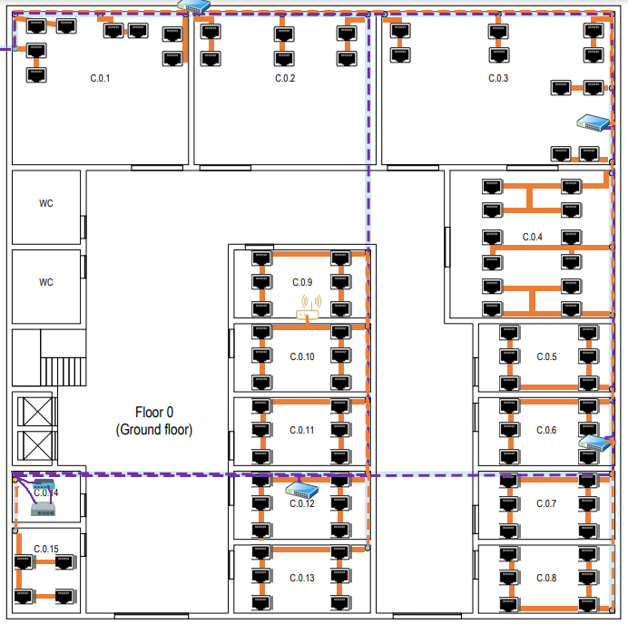
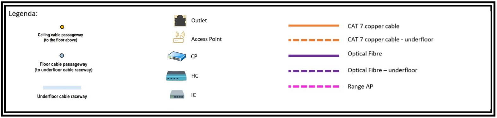
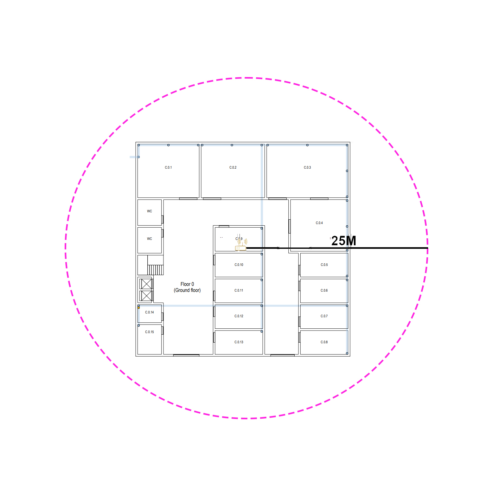
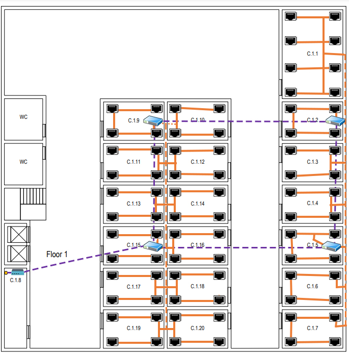
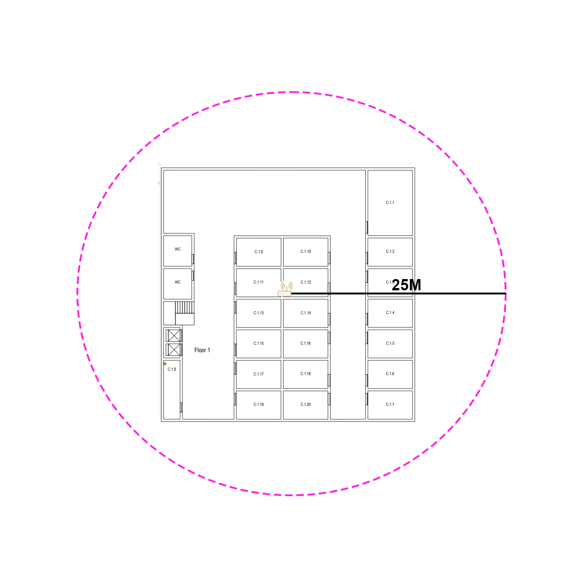

RCOMP 2022-2023 Project - Sprint 1 - Member 1211314 folder
===========================================

## Edificío C

### Medida do edificio
- 30m × 30m = 900 metros quadrados

## Piso 0

### Medida da escala:
- Escala: 230px ⇔ 5m

### Informações Calculadas:

| Sala   | Comprimento (px) | Largura (px) | Comprimento (m) | Largura (m) | A (m²) | Outlets |
|--------|------------------|--------------|-----------------|-------------|--------|---------|
| C.0.1  | 390              | 340          | 8,48            | 7,39        | 62.67  | 8*      |
| C.0.2  | 403              | 340          | 8,76            | 7,39        | 64.74  | 6*      |
| C.0.3  | 518              | 340          | 11,26           | 7,39        | 83.21  | 10*     |
| C.0.4  | 366              | 327          | 7,96            | 7,11        | 56.60  | 12      |
| C.0.5  | 302              | 150          | 6,57            | 3,26        | 21.42  | 6       |
| C.0.6  | 302              | 150          | 6,57            | 3,26        | 21.42  | 6       |
| C.0.7  | 302              | 150          | 6,57            | 3,26        | 21.42  | 6       |
| C.0.8  | 302              | 150          | 6,57            | 3,26        | 21.42  | 6       |
| C.0.9  | 302              | 150          | 6,57            | 3,26        | 21.42  | 6       |
| C.0.10 | 302              | 150          | 6,57            | 3,26        | 21.42  | 6       |
| C.0.11 | 302              | 150          | 6,57            | 3,26        | 21.42  | 6       |
| C.0.12 | 302              | 150          | 6,57            | 3,26        | 21.42  | 6       |
| C.0.13 | 302              | 150          | 6,57            | 3,26        | 21.42  | 6       |
| C.0.15 | 150              | 188          | 3,26            | 4,09        | 13,34  | 4       |

### Plano Esquemático:

### Legenda:

### Justificações Relevantes:

#### Outlets
* A sala C.0.1, C.0.2 e C.0.3 tem uma finalidade específica e os únicos *outlets* necessários são dois perto de cada passagem de cabo do andar.

* A sala E.0.14 é uma área de armazenamento que é usada para abrigar um *cross-connect* e *hardware* de infraestrutura de rede,
  nenhum *outlet* é necessária nesta sala, e o mesmo se aplica a banheiros e áreas comuns como *hall* de entrada e corredores.

* A distribuição dos *outlets* foi feita tendo em conta os locais mais adequados para que o espaço da sala não fosse muito
  comprometido, evitando também a sua colocação perto de portas e de forma a permitir um uso mais fácil da área central da
  sala para trabalhar.

* Ao posicionar os *outlets*, também se considerou que a distância máxima entre eles seria de três metros, para que em qualquer
  parte da sala onde o equipamento do utilizador estivesse, pudesse ser facilmente ligado a um *outlet* com o cabo fornecido.

* A quantidade de *outlets* por sala foi determinada com base numa proporção de 2 *outlets* por cada 10 metros quadrados de área.

#### Access Points (AP)
* Devido às dimensões do edifício, foi instalado apenas um *access* *point* neste andar.

* Conectados a um *outlet* por meio de um cabo de cobre *CAT7*, os *Access* *Points* oferecem uma cobertura de cerca de
  50 metros de diâmetro em formato circular.

##### Alcance do Access Point

* Para a determinação do alcance do *access* *point* utilizou-se um diâmetro de 50 m.

#### Consolidation Points (CP)
* Ao todo neste piso colocou-se 4 *Consolidation* *Points*:
    1. Entre a sala C.0.1 e a sala C.0.2, que é responsável por controlar essas salas, ficando responsável por 14 outlets;
    2. Na sala C.0.3, que é responsável por controlar as salas C.0.3 e C.0.4 ficando responsável por 22 outlets;
    3. Na sala C.0.6, que é responsável por controlar as salas C.0.5, C.0.6, C.0.7 e C.0.8 ficando responsável por 24 outlets.
    4. Na sala C.0.12, que é responsável por controlar as salas C.0.9, C.0.10, C.0.11, C.0.12, C.0.13 e pelo *access* *point*  ficando responsável por 30 outlets.

* O *underfloor* *cable* *raceway* realiza a ligação do *HC* com os *CP's*.

#### Horizontal cross-connect (HC)
* Devido à sua ampla cobertura de cerca de 1000 metros quadrados, este piso possui somente um *HC*, mesmo que a área total
  do edifício seja de apenas 900 metros quadrados.

* O *Horizontal* *cross-connect* está localizado na sala C.0.14 no mesmo armário técnico que o *Intermediate* *cross-connect*.

* O comprimento de cada cabo é inferior a 90 m.

#### Intermediate cross-connect (IC)
* O *IC* recebe a conexão de fibra óptica do *MC* e distribui o sinal para os dois *HC's* deste edifício por meio de cabos de fibra óptica.

* O *Intermediate* *cross-connect* está localizado na sala C.0.14 no mesmo armário técnico que o *Horizontal* *cross-connect*.

#### Cabos Utilizados e Respetivas Quantidades
* Para conectar os *CP's* aos *outlets* é utilizado o cabo de cobre CAT7.

* Por causa da inexistência de custos associados ao projeto e da possibilidade de alcançar uma transmissão de dados mais
  rápida, decidiu-se utilizar um cabo de fibra óptica monomodo de 8 fios para interligar o *HC* e os *CP's*, levando em
  conta também a redundância do sistema.

* Para a ligação do *IC* ao *HC* também utiliza-se fibra ótica monomodo de 8 fios.

##### Cabo de Cobre CAT7
###### Sala C.0.1
| Outlet    | Quantidade de cabo CAT 7 necessário desde o CP até ao outlet (m) |
|-----------|------------------------------------------------------------------|
| 1         | 4.06                                                             |
| 2         | 4.45                                                             |
| 3         | 4.06                                                             |
| 4         | 4.57                                                             |
| 5         | 4.03                                                             |
| 6         | 4.36                                                             |
| 7         | 4.06                                                             |
| 8         | 4.76                                                             |
| **Total** | 34,35                                                            |

###### Sala C.0.2
| Outlet    | Quantidade de cabo CAT 7 necessário desde o CP até ao outlet (m) |
|-----------|------------------------------------------------------------------|
| 1         | 2.97                                                             |
| 2         | 3.25                                                             |
| 3         | 3.92                                                             |
| 4         | 4.31                                                             |
| 5         | 3.92                                                             |
| 6         | 4.28                                                             |
| **Total** | 24.65                                                            |

###### Sala C.0.3
| Outlet    | Quantidade de cabo CAT 7 necessário desde o CP até ao outlet (m) |
|-----------|------------------------------------------------------------------|
| 1         | 3.92                                                             |
| 2         | 4.28                                                             |
| 3         | 3.92                                                             |
| 4         | 4.31                                                             |
| 5         | 3.92                                                             |
| 6         | 4.28                                                             |
| 7         | 3.92                                                             |
| 8         | 4.28                                                             |
| 9         | 3.90                                                             |
| 10        | 4.26                                                             |
| **Total** | 41.01                                                            |

###### Sala C.0.4
| Outlet    | Quantidade de cabo CAT 7 necessário desde o CP até ao outlet (m) |
|-----------|------------------------------------------------------------------|
| 1         | 7.23                                                             |
| 2         | 9.51                                                             |
| 3         | 11.41                                                            |
| 4         | 13.55                                                            |
| 5         | 7.32                                                             |
| 6         | 7.36                                                             |
| 7         | 6.76                                                             |
| 8         | 6.80                                                             |
| 9         | 13.56                                                            |
| 10        | 11.41                                                            |
| 11        | 9.51                                                             |
| 12        | 7.2                                                              |
| **Total** | 111.60                                                           |

###### Sala C.0.5 - C.0.13
| Outlet    | Quantidade de cabo CAT 7 necessário desde o CP até ao outlet (m) |
|-----------|------------------------------------------------------------------|
| 1         | 14.78                                                            |
| 2         | 13.90                                                            |
| 3         | 12.99                                                            |
| 4         | 8.78                                                             |
| 5         | 7.90                                                             |
| 6         | 6.99                                                             |
| **Total** | 59.34                                                            |

###### Sala C.0.14
| Outlet    | Quantidade de cabo CAT 7 necessário desde o CP até ao outlet (m) |
|-----------|------------------------------------------------------------------|
| 1         | 10.58                                                            |
| 2         | 8.78                                                             |
| 3         | 7.78                                                             |
| 4         | 5.78                                                             |
| **Total** | 25.12                                                            |

###### Access Point
| Quantidade de cabo CAT 7 necessário desde o outlet do AP até ao CP |
|--------------------------------------------------------------------|
| 8.70                                                               |

##### Cabo Fibra Ótica
| Ligação                            | Quantidade de cabo fibra ótica monomodo de 8 fios necessário (m) |
|------------------------------------|------------------------------------------------------------------|
| CP da sala C.0.2 até o HC do piso  | 80.29                                                            |
| CP da sala C.0.3 até o HC do piso  | 53.75                                                            |
| CP da sala E.0.6 até o HC do piso  | 41.71                                                            |
| CP da sala E.0.12 até o HC do piso | 23.61                                                            |
| IC até ao HC do piso               | 2.00                                                             |
| IC até a saída do edifício         | 88.63                                                            |
| **Total**                          | 299.99                                                           |

#### Gabinetes de Telecomunicações

##### Sala C.0.2
* Considerando que existem 13 *outlets* envolvidos, será necessário instalar um *patch* *panel* *CAT7* com 24 portas,
  tendo um tamanho de 1U.

* Como a conexão entre o *HC* e o *CP* é realizada com cabo de fibra ótica monomodo será necessário um *fiber* *patch* *panel*,
  tendo este o tamanho de 1U.

* Como está a ser usado 2U de *patch* *panels*, adiciona-se outras 2U para os *switches* correspondentes esperados,
  perfazendo 4U, e um dimensionamento adicional de 100%, perfazendo 8U. O tamanho disponível comercialmente acima de 6U é geralmente 12U.
  Posto isto, o tamanho total para este gabinete de telecomunicações será de 12U.

##### Sala C.0.3
* Considerando que existem 22 *outlets* envolvidos, será necessário instalar um *patch* *panels* *CAT7* com 24 portas cada,
  tendo cada um destes o tamanho de 1U.

* Como a conexão entre o *HC* e o *CP* é realizada com cabo de fibra ótica monomodo será necessário um *fiber* *patch* *panel*,
  tendo este o tamanho de 1U.

* Como está a ser usado 2U de *patch* *panels*, adiciona-se outras 2U para os *switches* correspondentes esperados,
  perfazendo 4U, e um dimensionamento adicional de 100%, perfazendo 8U. O tamanho disponível comercialmente acima de 6U é geralmente 12U.
  Posto isto, o tamanho total para este gabinete de telecomunicações será de 12U.

##### Sala C.0.6
* Considerando que existem 24 *outlets* envolvidos, será necessário instalar dois *patch* *panels* *CAT7* com 24 portas cada,
  tendo cada um destes o tamanho de 1U.

* Como a conexão entre o *HC* e o *CP* é realizada com cabo de fibra ótica monomodo será necessário um *fiber* *patch* *panel*,
  tendo este o tamanho de 1U.

* Como está a ser usado 2U de *patch* *panels*, adiciona-se outras 2U para os *switches* correspondentes esperados,
  perfazendo 4U, e um dimensionamento adicional de 100%, perfazendo 8U. O tamanho disponível comercialmente acima de 6U é geralmente 12U.
  Posto isto, o tamanho total para este gabinete de telecomunicações será de 12U.

##### Sala C.0.12
* Considerando que existem 30 *outlets* envolvidos, será necessário instalar dois *patch* *panels* *CAT7* com 24 portas cada,
  tendo cada um destes o tamanho de 1U.

* Como a conexão entre o *HC* e o *CP* é realizada com cabo de fibra ótica monomodo será necessário um *fiber* *patch* *panel*,
  tendo este o tamanho de 1U.

* Como está a ser usado 2U de *patch* *panels*, adiciona-se outras 2U para os *switches* correspondentes esperados,
  perfazendo 4U, e um dimensionamento adicional de 100%, perfazendo 8U. O tamanho disponível comercialmente acima de 6U é geralmente 12U.
  Posto isto, o tamanho total para este gabinete de telecomunicações será de 12U.

##### Sala C.0.14
* Considerando que o *HC* está ligado ao *IC* e a três *CP's*, é necessário utilizar um *fiber* *patch* *panel* para realizar essas conexões, tendo este o tamanho de 1U.

* Como está a ser usado um único *patch* *panel* de 1U, adicionamos outra 1U para o *switch* correspondente esperado, totalizando 2U,
e um dimensionamento adicional de 100%, perfazendo 4U. O tamanho disponível comercialmente começa em 6U.
Posto isto, **o tamanho total para este gabinete de telecomunicações será de 6U**.

### Inventário total do Piso 0:
| Equipamento                        | Quantidade | 
|------------------------------------|------------|
| Access Points                      | 1          |
| Cabo CAT7 (m)                      | 720,15     |
| Cabo Fibra Ótica (m)               | 299.99     |
| Copper Patch Cords (0.5m)          | 144        |
| Copper Patch Cords (5m)            | 81         |
| Fiber Patch Cords (0.5m)           | 96         |
| Fiber Patch Panel 1U (24 entradas) | 5          |
| Outlets                            | 94         |
| Fiber Patch Panel 1U (24 entradas) | 6          |
| Telecommunication Enclosure 6U     | 1          |
| Telecommunication Enclosure 12U    | 4          |

## Piso 1

### Medida da escala:
* Escala: 230px ⇔ 5m

### Informações Calculadas:
| Sala   | Comprimento (px) | Largura (px) | Comprimento (m) | Largura (m) | A (m²) | Outlets |
|--------|------------------|--------------|-----------------|-------------|--------|---------|
| C.1.1  | 240              | 352          | 5,22            | 7,65        | 39.93  | 8       |
| C.1.2  | 240              | 150          | 5,22            | 3,26        | 17.01  | 4       |
| C.1.3  | 240              | 150          | 5,22            | 3,26        | 17.01  | 4       |
| C.1.4  | 240              | 150          | 5,22            | 3,26        | 17.01  | 4       |
| C.1.5  | 240              | 150          | 5,22            | 3,26        | 17.01  | 4       |
| C.1.6  | 240              | 150          | 5,22            | 3,26        | 17.01  | 4       |
| C.1.7  | 240              | 150          | 5,22            | 3,26        | 17.01  | 4       |
| C.1.9  | 240              | 150          | 5,22            | 3,26        | 17.01  | 4       |
| C.1.10 | 240              | 150          | 5,22            | 3,26        | 17.01  | 4       |
| C.1.11 | 240              | 150          | 5,22            | 3,26        | 17.01  | 4       |
| C.1.12 | 240              | 150          | 5,22            | 3,26        | 17.01  | 4       |
| C.1.13 | 240              | 150          | 5,22            | 3,26        | 17.01  | 4       |
| C.1.14 | 240              | 150          | 5,22            | 3,26        | 17.01  | 4       |
| C.1.15 | 240              | 150          | 5,22            | 3,26        | 17.01  | 4       |
| C.1.16 | 240              | 150          | 5,22            | 3,26        | 17.01  | 4       |
| C.1.17 | 240              | 150          | 5,22            | 3,26        | 17.01  | 4       |
| C.1.18 | 240              | 150          | 5,22            | 3,26        | 17.01  | 4       |
| C.1.19 | 240              | 150          | 5,22            | 3,26        | 17.01  | 4       |
| C.1.20 | 240              | 150          | 5,22            | 3,26        | 17.01  | 4       |

### Plano Esquemático:

### Legenda:

### Justificações Relevantes:

#### Outlets
* As salas C.1.8 são áreas de armazenamento que são usadas para abrigar uma conexão cruzada e outro *hardware* de
  infraestrutura de rede, não são necessários *outlets*, o mesmo vale para banheiros e áreas comuns como *halls* e corredores.

* A distribuição dos *outlets* foi feita tendo em conta os locais mais adequados para que o espaço da sala não fosse muito
  comprometido, evitando também a sua colocação perto de portas e de forma a permitir um uso mais fácil da área central da
  sala para trabalhar.

* Ao posicionar os *outlets*, também se considerou que a distância máxima entre eles seria de três metros, para que em qualquer
  parte da sala onde o equipamento do utilizador estivesse, pudesse ser facilmente ligado a um *outlet* com o cabo fornecido.

* A quantidade de *outlets* por sala foi determinada com base numa proporção de 2 *outlets* por cada 10 metros quadrados de área.

#### Access Points (AP)
* Devido às dimensões do edifício, foi instalado apenas um *access* *point* no edifício, neste caso este encontra-se no piso 0.

##### Alcance do Access Point

* Para a determinação do alcance do access point que encontra-se no piso 0 utilizou-se aproximadamente um diâmetro de 50 m.

#### Consolidation Points (CP)
* Ao todo neste piso colocou-se 4 *Consolidation* *Points*:
    1. Na sala C.1.2, que é responsável por controlar as salas C.1.2 e C.1.3, ficando responsável por 16 outlets;
    2. Na sala E.1.5, que é responsável por controlar as salas E.1.4, E.1.5, E.1.6 e E.1.7 ficando responsável por 16 outlets;
    3. Na sala E.1.9, que é responsável por controlar as salas E.1.9, E.1.10, E.1.11, E.1.12, E.1.13 e E.1.14 ficando responsável por 24 outlets;
    4. Na sala E.1.15, que é responsável por controlar as salas E.1.15, E.1.16, E.1.17, E.1.18, E.1.19, E.1.20 ficando responsável por 24 outlets;
* O *underfloor* *cable* *raceway* realiza a ligação do *HC* com os *CP's*.
#### Horizontal cross-connect (HC)
* Este piso só possui um *HC*, pois o edifício tem apenas 900 metros quadrados de área e a norma exige que haja 1 *HC* por
  cada 1000 metros quadrados de área bruta.

* O *HC* está situado na sala C.1.8, dentro de um armário técnico, pois o cliente indicou que esta sala poderia ser utilizada
  para abrigar um *cross-connect*, sendo originalmente uma área de armazenamento.

* O comprimento de cada cabo é inferior a 90 m.

#### Cabos Utilizados e Respetivas Quantidades
* Para conectar os *CP's* *aos *outlets* é utilizado o cabo de cobre CAT7.

* Por causa da inexistência de custos associados ao projeto e da possibilidade de alcançar uma transmissão de dados mais
  rápida, decidiu-se utilizar um cabo de fibra óptica monomodo de 8 fios para interligar o *HC* e os *CP's*, levando em
  conta também a redundância do sistema.

* Para a ligação do *IC* ao *HC* também utiliza-se fibra ótica monomodo de 8 fios.

##### Cabo de Cobre CAT7
###### Sala C.1.1
| Outlet    | Quantidade de cabo CAT 7 necessário desde o CP até ao outlet (m) |
|-----------|------------------------------------------------------------------|
| 1         | 7.23                                                             |
| 2         | 9.51                                                             |
| 3         | 11.41                                                            |
| 4         | 13.55                                                            |
| 5         | 7.32                                                             |
| 6         | 7.36                                                             |
| 7         | 6.76                                                             |
| 8         | 6.80                                                             |
| **Total** | 62.58                                                            |

###### Sala C.1.2 á C.1.20
| Outlet    | Quantidade de cabo CAT 7 necessário desde o CP até ao outlet (m) |
|-----------|------------------------------------------------------------------|
| 1         | 14.78                                                            |
| 2         | 13.90                                                            |
| 3         | 12.99                                                            |
| 4         | 8.78                                                             |
| **Total** | 50.45                                                            |

###### Sala C.0.14
| Outlet    | Quantidade de cabo CAT 7 necessário desde o CP até ao outlet (m) |
|-----------|------------------------------------------------------------------|
| 1         | 10.58                                                            |
| 2         | 8.78                                                             |
| 3         | 7.78                                                             |
| 4         | 5.78                                                             |
| **Total** | 32.92                                                            |

##### Cabo Fibra Ótica
| Ligação                            | Quantidade de cabo fibra ótica monomodo de 8 fios necessário (m) |
|------------------------------------|------------------------------------------------------------------|
| CP da sala C.1.2 até o HC do piso  | 54.29                                                            |
| CP da sala C.1.5 até o HC do piso  | 45.75                                                            |
| CP da sala E.1.9 até o HC do piso  | 36.17                                                            |
| CP da sala E.1.15 até o HC do piso | 23.61                                                            |
| IC do piso 0 até o HC do piso 1    | 8.27                                                             |
| **Total**                          | 168.08                                                           |

#### Gabinetes de Telecomunicações

##### Sala C.1.2
* Considerando que existem 12 *outlets* envolvidos, será necessário instalar um *patch* *panels* *CAT7* com 24 portas cada,
  tendo cada um destes o tamanho de 1U.

* Como a conexão entre o *HC* e o *CP* é realizada com cabo de fibra ótica monomodo será necessário 1 *fiber* *patch* *panel*,
  tendo este o tamanho de 1U.

* Como está a ser usado 2U de *patch* *panels*, adiciona-se outras 2U para os *switches* correspondentes esperados, perfazendo 4U,
  e um dimensionamento adicional de 100%, perfazendo 8U.
  Posto isto, o tamanho total para este gabinete de telecomunicações será de 12U.

##### Sala C.1.5
* Considerando que existem 20 *outlets* envolvidos, será necessário instalar um *patch* *panel* *CAT7* com 24 portas,
  tendo um tamanho de 1U.

* Como a conexão entre o *HC* e o *CP* é realizada com cabo de fibra ótica monomodo será necessário 1 *fiber* *patch* *panel*,
  tendo este o tamanho de 1U.

* Como está a ser usado 2U de *patch* *panels*, adiciona-se outras 2U para os *switches* correspondentes esperados,
  perfazendo 4U, e um dimensionamento adicional de 100%, perfazendo 8U. O tamanho disponível comercialmente acima de 6U é geralmente 12U.
  Posto isto, o tamanho total para este gabinete de telecomunicações será de 12U.

##### Sala C.1.9
* Considerando que existem 24 *outlets* envolvidos, será necessário instalar dois *patch* *panels* *CAT7* com 24 portas cada,
  tendo cada um destes o tamanho de 1U.

* Como a conexão entre o *HC* e o *CP* é realizada com cabo de fibra ótica monomodo será necessário 1 *fiber* *patch* *panel*,
  tendo este o tamanho de 1U.

* Como está a ser usado 3U de *patch* *panels*, adiciona-se outras 3U para os *switches* correspondentes esperados, perfazendo 6U,
  e um dimensionamento adicional de 100%, perfazendo 12U.
  Posto isto, o tamanho total para este gabinete de telecomunicações será de 12U.

##### Sala C.1.15
* Considerando que existem 24 *outlets* envolvidos, será necessário instalar dois *patch* *panels* *CAT7* com 24 portas cada,
  tendo cada um destes o tamanho de 1U.

* Como a conexão entre o *HC* e o *CP* é realizada com cabo de fibra ótica monomodo será necessário 1 *fiber* *patch* *panel*,
  tendo este o tamanho de 1U.

* Como está a ser usado 3U de *patch* *panels*, adiciona-se outras 3U para os *switches* correspondentes esperados, perfazendo 6U,
  e um dimensionamento adicional de 100%, perfazendo 12U.
  Posto isto, o tamanho total para este gabinete de telecomunicações será de 12U.

##### Sala C.1.8
* Considerando que o *HC* está ligado ao *IC* que encontra-se no piso 0 e a cinco *CP's* através de cabo de fibra ótica monomodo,
  é necessário utilizar um *fiber* *patch* *panel* para realizar essas conexões, tendo este o tamanho de 1U.

* Como está a ser usado um único *patch* *panel* de 1U, adicionamos outra 1U para o *switch* correspondente esperado, totalizando 2U,
  e um dimensionamento adicional de 100%, perfazendo 4U. O tamanho disponível comercialmente começa em 6U.
  Posto isto, o tamanho total para este gabinete de telecomunicações será de 6U.

### Inventário total do Piso 1:
| Equipamento                         | Quantidade | 
|-------------------------------------|------------|
| Copper Cable CAT7 (m)               | 1003.60    |
| Copper Patch Cords (0.5m)           | 144        |
| Copper Patch Cords (5m)             | 80         |
| Copper Patch Panel 1U (24 entradas) | 6          |
| Fiber Optic Cable (m)               | 168.08     |
| Fiber Patch Cords (0.5m)            | 120        |
| Fiber Patch Panel 1U (24 entradas)  | 5          |
| Outlets                             | 80         |
| Telecommunication Enclosure 12U     | 4          |
| Telecommunication Enclosure 6U      | 1          |

## Inventário total do Edifício:
| Equipamento                         | Quantidade | 
|-------------------------------------|------------|
| Access Points                       | 1          |
| Copper Cable CAT7 (m)               | 2073.32    |
| Copper Patch Cords (0.5m)           | 264        |
| Copper Patch Cords (5m)             | 174        |
| Copper Patch Panel 1U (24 entradas) | 11         |
| Fiber Optic Cable (m)               | 300.40     |
| Fiber Patch Cords (0.5m)            | 264        |
| Fiber Patch Panel 1U (24 entradas)  | 11         |
| Outlets                             | 174        |
| Telecommunication Enclosure 12U     | 8          |
| Telecommunication Enclosure 6U      | 2          |

#### Justificações Relevantes
* *Patch* *Cords* *CAT7* de cobre e fibra óptica necessários para cada gabinete de telecomunicações é igual ao número de
  portas do patch panel em cada um. *Patch* *cords* devem ter comprimento curto, geralmente 0,5 metros é suficiente.

* Para os *outlets*, devem ser fornecidos patch cords mais longos, até 5 metros de comprimento.