RCOMP 2022-2023 Project - Sprint 2 - Member 1191296 folder
===========================================

# Edificío E

## *VLAN* *database* e rede *IPv4*

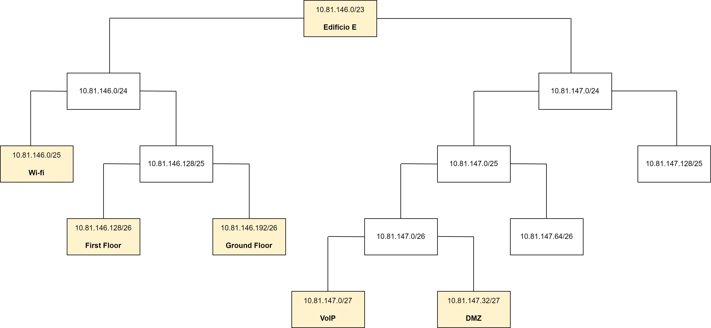

|              | ID da VLAN | Nome da VLAN | Total de nodes | IP da rede       | Primeiro host | Último host   | Broadcast     | Máscara de sub-rede |
|--------------|------------|--------------|----------------|------------------|---------------|---------------|---------------|---------------------|
| Wi-Fi        | 573        | Ewifi        | 70             | 10.81.146.0/25   | 10.81.146.1   | 10.81.146.126 | 10.81.146.127 | 255.255.255.128     |
| First Floor  | 572        | Efloorone    | 60             | 10.81.146.128/26 | 10.81.146.129 | 10.81.146.190 | 10.81.146.191 | 255.255.255.192     |
| Ground Floor | 571        | Egroundfloor | 45             | 10.81.146.192/26 | 10.81.146.193 | 10.81.146.254 | 10.81.146.255 | 255.255.255.192     |
| VoIP         | 575        | Evoip        | 25             | 10.81.147.0/27   | 10.81.147.1   | 10.81.147.30  | 10.81.147.31  | 255.255.255.224     |
| DMZ          | 574        | Edmz         | 20             | 10.81.147.32/27  | 10.81.147.33  | 10.81.147.62  | 10.81.147.63  | 255.255.255.224     |

### Justificações Relevantes
- As redes foram organizadas em ordem decrescente de nodes, preenchendo assim o maior número possível de endereços sem eles serem desperdiçados.

- Apesar da distribuição de endereços de rede *IPv4* ser adequada, existem ainda *IP's* que podem ser atribuídos a novos nodes 
  que podem ser introduzidos no futuro. Podemos então observar a seguinte contagem de endereços disponíveis em cada *VLAN*:

| VLAN         | Total de nodes disponíveis |
|--------------|----------------------------|
| Wi-Fi        | 56                         |
| First Floor  | 2                          |
| Ground Floor | 17                         |
| VoIP         | 5                          |
| DMZ          | 10                         |

- Esta solução permite uma futura expansão no edifício E, se necessário, porque as redes 10.81.147.64/26 e 10.81.147.128/25 
  estão vazias, as quais podem ser divididas em mais redes conforme necessário.

## Simulação no *Packet* *Tracer*
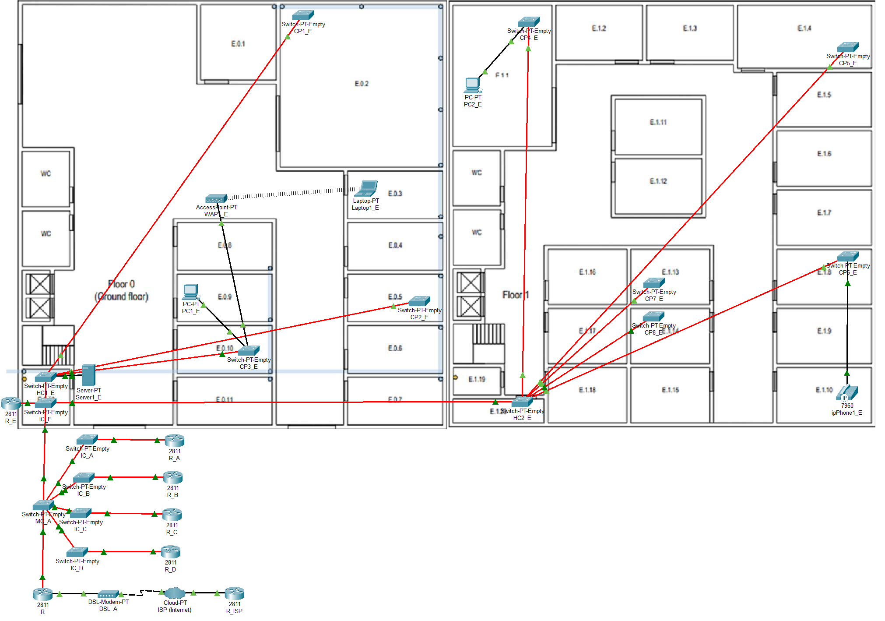

### Justificações Relevantes
- A abordagem adotada está conforme o que foi estabelecido no *Sprint 1*.

- Conforme solicitado, a simulação permite a comunicação entre as diferentes *VLANs* e a comunicação com o *ISP*. 
  Cada *router* encaminha qualquer endereço desconhecido para o *router* presente no MC e este encaminha para cada edifício 
  ou para o *ISP* através de um *modem* *DSL*.

- Todos os *switches* foram configurados para ter o número de portas necessário para estabelecer as conexões especificadas
  no enunciado (portas *FFE* para cabos de fibra óptica e portas *CFE* para cabos de cobre).

- Todas as conexões entre *switches* foram alteradas para o modo trunk, o domínio *VTP* alterado para o domínio fornecido (rc23dig3) 
  e o *switch* MC configurado no modo servidor, os restantes foram configurados no modo cliente, permitindo que todos os 
  *switches* em todos os edifícios tenham na sua base de dados *VLAN* todas as *VLANs* configuradas.

- O *IP* do *laptop* foi configurado, mas mesmo ao salvar o projeto, ele é apagado. Por isso, é preciso definir sempre que iniciamos o projeto.
  Portanto, esta é uma representação da configuração utilizada para ele:

|           | Gateway     | Endereço IPv4 | Máscara de sub-rede |
|-----------|-------------|---------------|---------------------|
| Laptop1_E | 10.81.146.1 | 10.81.146.2   | 255.255.255.128     |

- Todos os equipamentos que possuem locais para instalação de módulos (como por exemplo, o local do *switch* onde é possível instalar
  um módulo PT-SWITCH-NM-1FFE), no caso dos que se encontravam sem qualquer tipo de instalação, foram coladas placas de cobertura de forma a
  proteger os componentes eletrónicos internos. Estas placas também ajudam a manter o resfriamento adequado ao normalizar o fluxo de ar.

## Configuração de Rede
### *Backbone*
- O *backbone* do *campus* é representado na simulação por meio do *switch* MC_A (correspondente ao principal *cross-connect* do *campus*), 
  pelos vários *switches* IC de todos os edifícios do *campus* e pelo *router* do edifício E, uma vez que é o responsável pela comunicação entre os vários edifícios do *campus*.

- Assim como no 1º Sprint, a transmissão de dados para os edifícios foi realizada por meio de uma conexão *inter-cross* *connects*, 
  representada pelo *switch* IC_E, pelos *horizontal* *connects*, representados pelos *switches* HC1_E e HC2_E, e destes para os CPs ou dispositivos finais. 

- Deve-se notar que as conexões MC-IC, IC-HC, HC-HC, HC-CP foram feitas usando cabo de fibra óptica, sendo necessário o uso 
  de adaptadores *FFE* nos *switches* e no *router* R_E, que está conectado a IC_E. A conexão entre os dispositivos finais e os CPs e HCs foi feita usando cabo de cobre.

### Conexão de Internet
- A representação da conexão com a *Internet* é feita através de uma *Cloud*, um *router* *ISP* e um *Modem*, respeitando 
  a configuração mostrada na *PL3*. Possui apenas 2 endereços válidos (além dos reservados para identificação de rede e *broadcasting*), 
  sendo o primeiro associado ao *router* do *ISP*, e o segundo associado ao *router* *MC*.

### Especificações
- A implementação dos requisitos propostos para o edifício E começa a partir do *switch* com nome de *host* IC_E, que estabelece 
  uma conexão com outros dois *switches* representando os andares 0 e 1 (HC1_E e HC2_E, respectivamente). 
  
- Todas as portas que não estão conectadas a dispositivos finais são configuradas no modo *trunk*, sendo o tipo de porta indicado para estabelecer conexões com várias *VLANs*. 
  Por outro lado, as portas que se conectam a dispositivos finais são configuradas no modo *access*, uma vez que se conectam apenas a uma única *VLAN*.

- Nas configurações dos dois HC's do edifício, as seguintes VLANs foram associadas aos dispositivos finais:

| VLAN | Dispositivo (exemplo) |
|------|-----------------------|
| 571  | PC1_E                 |
| 572  | PC2_E                 |
| 573  | Laptop1_E             |
| 574  | Server1_E             |
| 575  | ipPhone1_E            |

- Visto que o principal objetivo do *sprint* é apresentar um plano de implementação lógica para a rede e por questões de 
  interpretação, optou-se por não apresentar a quantidade total de *nodes* indicados no enunciado. 
  Assim, cada dispositivo final apresentado na simulação representa a totalidade dos dispositivos que seriam necessários:

| Dispositivo | Total de nodes |
|-------------|----------------|
| PC1_E       | 45             |
| PC2_E       | 60             |
| Laptop1_E   | 70             |
| Server1_E   | 20             |
| ipPhone1_E  | 25             |

### Pings
- Para confirmar que tudo funciona corretamente, são exibidas várias imagens que mostram o sucesso dos testes de *ping* 
  entre dispositivos finais no mesmo edifício e entre edifícios diferentes, incluindo o ISP.

#### Entre o *PC1* e o edifício E
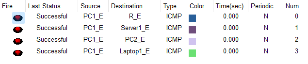

#### Entre o *PC2* e o edifício E
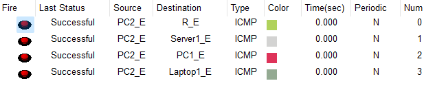

#### Entre o *laptop* e o edifício E
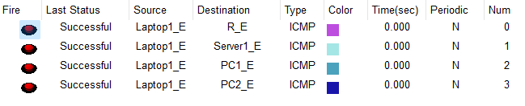

#### Entre o *server* e o edifício E
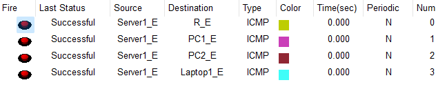

#### Entre o *router* e o edifício E
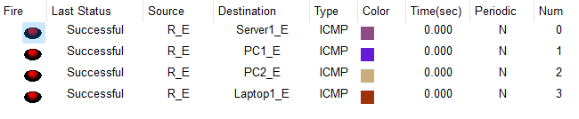

#### Entre o *PC1* do edifício E e os outros edifícios, incluindo o *ISP*
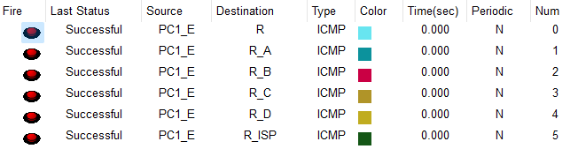

#### Entre o *PC2* do edifício E e os outros edifícios, incluindo o *ISP*
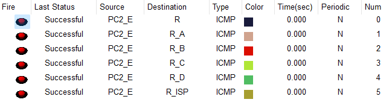

#### Entre o *laptop* do edifício E e os outros edifícios, incluindo o *ISP*
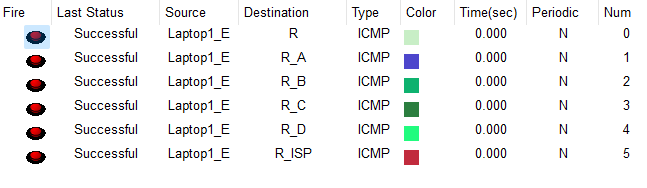

#### Entre o *server* do edifício E e os outros edifícios, incluindo o *ISP*
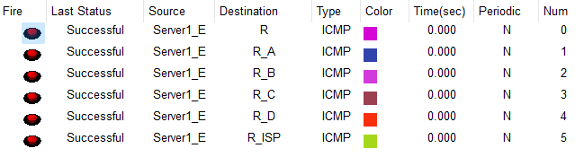

#### Entre o *router* do edifício E e os outros edifícios, incluindo o *ISP*
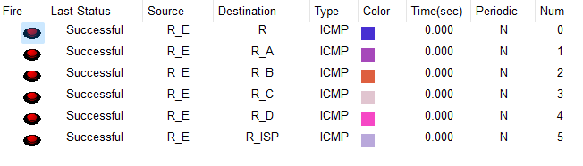

### Ficheiros de configuração de *switches* e *routers*
- Os arquivos de configuração de todos os *switches* e *routers* necessários para o correto funcionamento do projeto de
  cabeamento estruturado do edifício E podem ser encontrados neste *link*: [Pasta de ficheiros de configuração](config%20files)

### Tabelas de Roteamento
#### Edifício A MC - R_A (10.81.151.6/25)
| Edifício | Rede           | Máscara         | Próximo *Hop*  |
|----------|----------------|-----------------|----------------|
| A        | 10.81.144.0/23 | 255.255.254.0   | 10.81.151.1    |
| B        | 10.81.148.0/24 | 255.255.255.0   | 10.81.151.2    |
| C        | 10.81.149.0/24 | 255.255.255.0   | 10.81.151.3    |
| D        | 10.81.150.0/24 | 255.255.255.0   | 10.81.151.4    |
| E        | 10.81.146.0/24 | 255.255.255.0   | 10.81.151.5    |
| E        | 10.81.147.0/26 | 255.255.255.192 | 10.81.151.5    |
| Internet | 0.0.0.0/0      | 0.0.0.0         | 121.60.202.181 |

#### Edifício E - R_E (10.81.151.5/25)
| Rede      | Máscara | Próximo *Hop* |
|-----------|---------|---------------|
| 0.0.0.0/0 | 0.0.0.0 | 10.81.151.6   |

#### ISP - R-ISP (15.203.47.93/30) ###
| Rede           | Máscara       | Próximo *Hop*  |
|----------------|---------------|----------------|
| 10.81.144.0/21 | 255.255.248.0 | 121.60.202.182 |