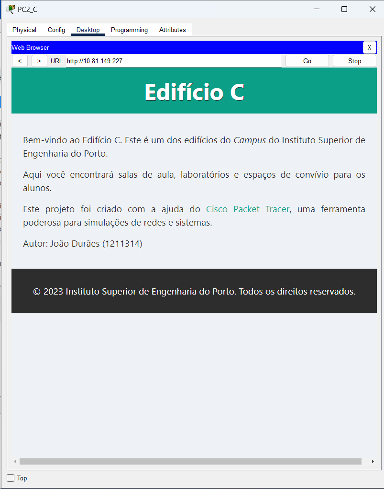
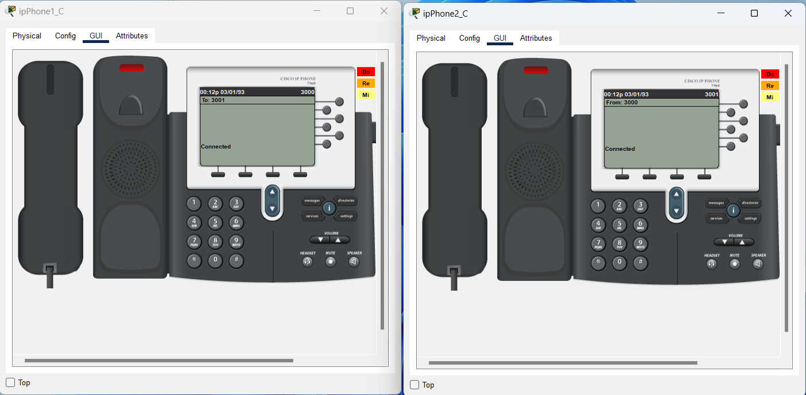
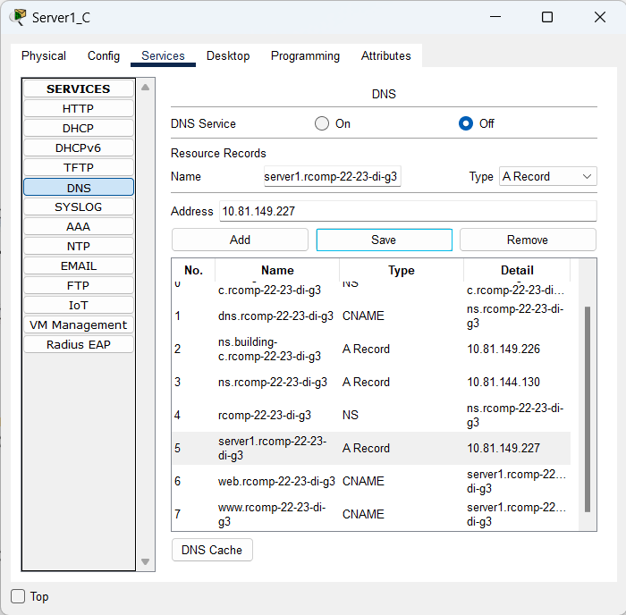

RCOMP Project - Sprint 3 - Member 1211314 folder
===========================================

# Edificío C

## *OSPF dynamic routing*
- O roteamento estático não é mais utilizado, portanto, em cada *router* as tabelas de roteamento estático existentes
  foram apagadas, exceto a rota padrão que conecta ao *ISP* (já que sem essa rota não haveria distribuição de *internet* no *campus*).

- A infraestrutura geral agora é um domínio *OSPF* sendo dividida em áreas *OSPF*, uma para cada edifício e a área do *backbone* (área 0).

### Configuração do *router* do edifício A:
```
router ospf 1
network 10.81.151.0 0.0.0.127 area 0
network 10.81.144.0 0.0.1.255 area 1
```

### Configuração do *router* do edifício B:
```
router ospf 2
network 10.81.151.0 0.0.0.127 area 0
network 10.81.148.0 0.0.0.255 area 2
```

### Configuração do *router* do edifício C:
```
router ospf 3
network 10.81.151.0 0.0.0.127 area 0
network 10.81.149.0 0.0.0.255 area 3
```

### Configuração do *router* do edifício D:
```
router ospf 4
network 10.81.151.0 0.0.0.127 area 0
network 10.81.150.0 0.0.0.255 area 4
```

### Configuração do *router* do edifício E:
```
router ospf 5
network 10.81.151.0 0.0.0.127 area 0
network 10.81.146.0 0.0.0.255 area 5
network 10.81.147.0 0.0.0.63 area 5
```

### Configuração do *router* do *backbone*:
```
router ospf 6
network 10.81.151.0 0.0.0.127 area 0
default-information originate
```

## *HTTP servers*
- Na *VLAN DMZ* adicionou-se outro servidor para assumir o serviço *HTTP*.

- Nos serviços deste servidor habilitou-se o serviço HTTP e adicionou-se uma página HTML simples identificando o edifício.



## *DHCPv4 service*
- O *router* de cada edifício fornece o serviço *DHCPv4* a todas as redes locais (dentro do edifício), exceto para as redes
  *DMZ* e o *backbone*, onde os endereços *IPv4* são estáticos e definidos manualmente.

- Para a *VLAN VoIP*, a configuração do servidor *DHCP* inclui a opção 150, que representa o endereço *IP* do servidor *TFTP*
  (*Trivial File Transfer Protocol*) a ser utilizado pelos telefones.

- Todos os computadores e *laptops* passaram a receber a configuração de rede por *DHCP*.

### Piso 0
```
ip dhcp pool Cgroundfloor
network 10.81.149.128 255.255.255.192
default-router 10.81.149.129
dns-server 10.81.149.226
domain-name rcomp-22-23-di-g3
```

### Piso 1
```
ip dhcp pool Cfloorone
network 10.81.149.64 255.255.255.192
default-router 10.81.149.65
dns-server 10.81.149.226
domain-name rcomp-22-23-di-g3
```

### *Wi-Fi*
```
ip dhcp pool Cwifi
network 10.81.149.0 255.255.255.192
default-router 10.81.149.1
dns-server 10.81.149.226
domain-name rcomp-22-23-di-g3
```

### *VoIP*
```
ip dhcp pool Cvoip
network 10.81.149.192 255.255.255.224
default-router 10.81.149.193
option 150 ip 10.81.149.193
dns-server 10.81.149.226
domain-name rcomp-22-23-di-g3
```

### Remoção dos endereços de *gateway*
```
ip dhcp excluded-address 10.81.149.129
ip dhcp excluded-address 10.81.149.65
ip dhcp excluded-address 10.81.149.1
ip dhcp excluded-address 10.81.149.193
```

## *VoIP service*
### Configuração dos *Switches*
- Nas portas dos *switches* que conectam aos telefones colocou-se a *VLAN* de voz ativada e a *VLAN* de acesso desativada.

#### *Consolidation Point 2*
```
interface FastEthernet8/1
switchport mode access
switchport voice vlan 565
no switchport access vlan
```

#### *Consolidation Point 5*
```
interface FastEthernet8/1
switchport mode access
switchport voice vlan 565
no switchport access vlan
```

### Registo automático do telefone e atribuição do número de diretório
- Como o DHCP já estava configurado apenas foi necessário configurar no *router* do edifício o serviço de telefonia e o
  número de telefone de cada um.
```
telephony-service
auto-reg-ephone
ip source-address 10.81.149.193 port 2000
max-ephones 30
max-dn 30
auto assign 1 to 2

ephone-dn 1
number 3000

ephone-dn 2
number 3001
```

### Encaminhamento das chamadas
- Para as chamadas entre os edifícios usou-se o comando *dial-peer voice*. Cada padrão é reencaminhado para o *router* do respetivo edifício.
```
dial-peer voice 1 voip
destination-pattern 1...
session target ipv4:10.81.151.1

dial-peer voice 2 voip
destination-pattern 2...
session target ipv4:10.81.151.2

dial-peer voice 4 voip
destination-pattern 4...
session target ipv4:10.81.151.4

dial-peer voice 5 voip
destination-pattern 5...
session target ipv4:10.81.151.5
```

Como os telefones *VoIP* foram adicionados e configurados na rede, agora podem comunicar-se entre si.



## *DNS*
- O servidor colocado no último sprint é utilizado como um servidor *DNS*.

- Dentro do banco de dado *DNS*, todos os nomes são *FQDN* (nomes de domínio totalmente qualificados), por isso todos
  os nomes definidos terminam com *rcomp-22-23-di-g3*.

- O domínio *DNS* local do edifício C é building-c.rcomp-22-23-di-g3.

- O servidor *DNS* possui o nome *DNS* não qualificado *ns.building-e.rcomp-22-23-di-g3* para o edifício C. Este servidor também
  conhece o endereço *IPv4* do servidor *DNS* do domínio raiz, *rcomp-22-23-di-g3*.

- O servidor *HTTP* foi nomeado como *server1* (*A record*). Dentro do domínio *DNS*, existe dois pseudônimos *www* e *web*
  (*CNAME*), ambos mapeados para o *server1* (*A record*) do mesmo domínio. Existe um pseudônimo adicional, com o nome *dns*
  (*CNAME*), mapeado para o ns do domínio (*A record*).

- Nos servidores adicionou-se manualmente o *IPv4* do servidor *DNS*.

**Tabela *DNS* configurada no servidor 1 do edifício C (Server1_C):**

| No. | Name                            | Type      | Detail                          |
|-----|---------------------------------|-----------|---------------------------------|
| 0   | building-c.rcomp-22-23-di-g3    | NS        | ns.building-c.rcomp-22-23-di-g3 |
| 1   | dns.rcomp-22-23-di-g3           | CNAME     | ns.rcomp-22-23-di-g3            |
| 2   | ns.building-c.rcomp-22-23-di-g3 | A Record  | 10.81.149.226                   |
| 3   | ns.rcomp-22-23-di-g3            | A Record  | 10.81.144.130                   |
| 4   | rcomp-22-23-di-g3               | NS        | ns.rcomp-22-23-di-g3            |
| 5   | server1.rcomp-22-23-di-g3       | A Record  | 10.81.147.35                    |
| 6   | web.rcomp-22-23-di-g3           | CNAME     | server1.rcomp-22-23-di-g3       |
| 7   | www.rcomp-22-23-di-g3           | CNAME     | server1.rcomp-22-23-di-g3       |



## *NAT (Network Address Translation)*
- O *NAT* estático foi utilizado para redirecionar o tráfego, por isso no *router* do edifício foram aplicadas as configurações
  pedidas.

- As solicitações *HTTP* e *HTTPS* recebidas na interface do *backbone* do *router* são redirecionadas para o servidor *HTTP*
  na *DMZ* local. Tanto o *HTTP* quanto o *HTTPS* usam conexões *TCP* e assumem que os números de porta padrão do serviço são usados, 80 e 443.

```
ip nat inside source static tcp 10.81.149.225 80 10.81.151.3 80
ip nat inside source static tcp 10.81.149.225 443 10.81.151.3 443
```

- As solicitações *DNS* recebidas na interface do *backbone* do *router* são redirecionadas para o servidor *DNS* na *DMZ* local.
  O serviço *DNS* usa conexões *TCP* e *UDP*, em ambos os casos, o número de porta padrão do serviço é 53.

```
ip nat inside source static tcp 10.81.149.224 53 10.81.151.3 53
ip nat inside source static udp 10.81.149.224 53 10.81.151.3 53
```

- Cada *VLAN* foi colocada dentro da *NAT* criada, exceto o *backbone*.

```
interface FastEthernet1/0.550
ip nat outside

interface FastEthernet1/0.561
ip nat inside

interface FastEthernet1/0.562
ip nat inside

interface FastEthernet1/0.563
ip nat inside

interface FastEthernet1/0.564
ip nat inside

interface FastEthernet1/0.565
ip nat inside
```

## *Static Firewall (ACLs)*

- As *ACLs* serão implementadas no *router* de cada edifício. Elas serão particularmente restritivas ao tráfego trocado
  com a *DMZ* local e no tráfego destinado ao próprio *router*.

### Backbone
```
access-list 100 deny ip 10.81.149.0 0.0.0.255 any
access-list 100 permit ospf any host 10.81.151.3
access-list 100 permit udp any host 10.81.151.3 eq 53
access-list 100 permit tcp any host 10.81.151.3 eq 53
access-list 100 permit tcp any host 10.81.151.3 eq 80
access-list 100 permit tcp any host 10.81.151.3 eq 443
access-list 100 permit tcp any host 10.81.151.3 eq 2000
access-list 100 deny ip any host 10.81.151.3
access-list 100 permit ip any any
```

### Piso 0
```
access-list 101 permit ip host 0.0.0.0 host 255.255.255.255					
access-list 101 permit ip 10.81.149.128 0.0.0.63 any
```

### Piso 1
```
access-list 102 permit ip host 0.0.0.0 host 255.255.255.255
access-list 102 permit ip 10.81.149.64 0.0.0.63 any
```

### Wi-fi
```
access-list 103 permit ip host 0.0.0.0 host 255.255.255.255
access-list 103 permit ip 10.81.149.0 0.0.0.63 any
```

### DMZ
```
access-list 104 deny ip 10.81.149.224 0.0.0.31 any
access-list 104 permit udp any host 10.81.149.224 eq 53
access-list 104 permit tcp any host 10.81.149.224 eq 53
access-list 104 permit tcp any host 10.81.149.225 eq 80
access-list 104 permit tcp any host 10.81.149.225 eq 443
```

### VoIP
```
access-list 105 permit ip host 0.0.0.0 host 255.255.255.255
access-list 105 permit udp 10.81.149.192 0.0.0.31 host 10.81.151.3 eq 69
access-list 105 permit tcp 10.81.149.192 0.0.0.31 host 10.81.151.3 eq 2000
access-list 105 permit ip 10.81.149.192 0.0.0.31 any
```

### Agrupamento das *ACLs*:

```
interface FastEthernet1/0.550
ip access-group 100 in

interface FastEthernet1/0.561
ip access-group 101 in

interface FastEthernet1/0.562
ip access-group 102 in

interface FastEthernet1/0.563
ip access-group 103 in

interface FastEthernet1/0.564
ip access-group 104 out

interface FastEthernet1/0.565
ip access-group 105 in
```
